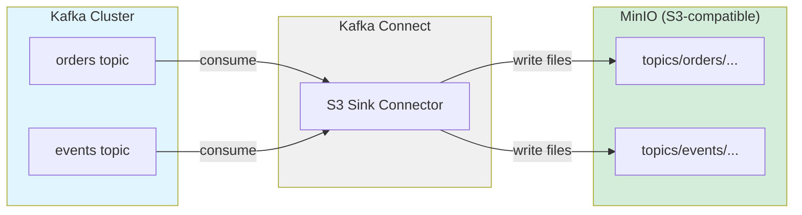

# Exercise 13: Topic Backup to S3 Storage

## Learning Objectives

- Understand Kafka Connect and sink connectors
- Configure S3 Sink Connector for topic archival
- Set up MinIO as S3-compatible object storage
- Manage data partitioning and formatting (JSON, Avro, Parquet)
- Implement time-based and size-based file rotation
- Learn long-term data retention strategies with Kafka

## What You'll Build

In this exercise, you'll create:
1. **Kafka Cluster**: Source cluster with streaming data
2. **MinIO**: S3-compatible object storage for backups
3. **Kafka Connect**: S3 Sink Connector for automated archival
4. **Producer**: Generates continuous data streams
5. **Backup Verification**: Tools to verify archived data

## Prerequisites

- Completed exercises 1-12
- Docker and Docker Compose installed
- Basic understanding of Kafka Connect
- Familiarity with object storage concepts (S3)

## Architecture



S3 Sink Connector features:
- **Automatic Archival**: Continuously backs up topic data to S3
- **Flexible Formats**: Support for JSON, Avro, Parquet, and more
- **Partitioning**: Time-based and field-based partitioning
- **Exactly-once delivery**: Prevents duplicate files
- **Compression**: Gzip, Snappy, LZ4 support
- **Schema Evolution**: Handles schema changes with Avro/Parquet

## Tasks

### Task 1: Start the Environment

Start Kafka, MinIO, and Kafka Connect:

```bash
docker compose up -d
```

This starts:
- `kafka`: Kafka broker (port 9092)
- `minio`: MinIO object storage (port 9000, console: 9001)
- `kafka-connect`: Kafka Connect with S3 connector (port 8083)
- `kafka-ui`: Web UI (port 8080)

Wait about 30-45 seconds for all services to initialize.

### Task 2: Verify Kafka is Running

Check Kafka is ready:

```bash
docker exec -it kafka /opt/kafka/bin/kafka-topics.sh \
  --list \
  --bootstrap-server localhost:9092
```

### Task 3: Access MinIO Console

Open http://localhost:9001 in your browser.

Login credentials:
- **Username**: `minioadmin`
- **Password**: `minioadmin`

You should see the MinIO console dashboard.

### Task 4: Create S3 Bucket

In the MinIO console:
1. Click "Buckets" in the left menu
2. Click "Create Bucket"
3. Name it `kafka-backup`
4. Click "Create Bucket"

Or use the MinIO CLI:

```bash
docker exec -it minio mc mb minio/kafka-backup
```

### Task 5: Create Kafka Topics

Create topics that we'll archive to S3:

```bash
# Create orders topic
docker exec -it kafka /opt/kafka/bin/kafka-topics.sh \
  --create \
  --topic orders \
  --bootstrap-server localhost:9092 \
  --partitions 3 \
  --replication-factor 1

# Create events topic
docker exec -it kafka /opt/kafka/bin/kafka-topics.sh \
  --create \
  --topic events \
  --bootstrap-server localhost:9092 \
  --partitions 2 \
  --replication-factor 1
```

Verify topics:

```bash
docker exec -it kafka /opt/kafka/bin/kafka-topics.sh \
  --list \
  --bootstrap-server localhost:9092
```

### Task 6: Verify Kafka Connect is Running

Check Kafka Connect status:

```bash
curl http://localhost:8083/
```

You should see version information.

List available connector plugins:

```bash
curl http://localhost:8083/connector-plugins | python3 -m json.tool
```

Look for `io.confluent.connect.s3.S3SinkConnector` in the list.

### Task 7: Understand the S3 Sink Configuration

Examine the connector configuration:

```bash
cat s3-sink-connector.json
```

Key configuration elements:
- **topics**: Which Kafka topics to backup
- **s3.bucket.name**: Target S3 bucket
- **flush.size**: Number of records before writing a file
- **rotate.interval.ms**: Time-based file rotation
- **format.class**: Output format (JSON, Avro, Parquet)
- **partitioner.class**: How to organize files (time, field-based)
- **storage.class**: S3-compatible storage implementation

### Task 8: Deploy the S3 Sink Connector

Create the connector:

```bash
curl -X POST http://localhost:8083/connectors \
  -H "Content-Type: application/json" \
  -d @s3-sink-connector.json
```

Verify it was created:

```bash
curl http://localhost:8083/connectors
```

You should see `["s3-sink"]` in the response.

### Task 9: Check Connector Status

View the connector status:

```bash
curl http://localhost:8083/connectors/s3-sink/status | python3 -m json.tool
```

Look for:
- `"state": "RUNNING"`
- All tasks should be in `"RUNNING"` state

### Task 10: Produce Messages to Orders Topic

Generate order data:

```bash
docker exec -it kafka /opt/kafka/bin/kafka-console-producer.sh \
  --topic orders \
  --bootstrap-server localhost:9092 \
  --property "parse.key=true" \
  --property "key.separator=:"
```

Enter these messages (press Ctrl+D when done):
```
order-1:{"orderId": "order-1", "customerId": "cust-100", "amount": 99.99, "product": "Laptop", "timestamp": "2024-12-03T10:00:00Z"}
order-2:{"orderId": "order-2", "customerId": "cust-101", "amount": 149.50, "product": "Mouse", "timestamp": "2024-12-03T10:05:00Z"}
order-3:{"orderId": "order-3", "customerId": "cust-102", "amount": 299.99, "product": "Keyboard", "timestamp": "2024-12-03T10:10:00Z"}
order-4:{"orderId": "order-4", "customerId": "cust-100", "amount": 49.99, "product": "USB Cable", "timestamp": "2024-12-03T10:15:00Z"}
order-5:{"orderId": "order-5", "customerId": "cust-103", "amount": 199.00, "product": "Monitor", "timestamp": "2024-12-03T10:20:00Z"}
```

### Task 11: Produce Messages to Events Topic

Generate event data:

```bash
docker exec -it kafka /opt/kafka/bin/kafka-console-producer.sh \
  --topic events \
  --bootstrap-server localhost:9092
```

Enter:
```
{"eventId": "evt-001", "type": "user_login", "userId": "user-100", "timestamp": "2024-12-03T10:00:00Z"}
{"eventId": "evt-002", "type": "page_view", "userId": "user-101", "page": "/home", "timestamp": "2024-12-03T10:05:00Z"}
{"eventId": "evt-003", "type": "button_click", "userId": "user-100", "button": "checkout", "timestamp": "2024-12-03T10:10:00Z"}
{"eventId": "evt-004", "type": "user_logout", "userId": "user-100", "timestamp": "2024-12-03T10:15:00Z"}
{"eventId": "evt-005", "type": "error", "userId": "user-102", "error": "timeout", "timestamp": "2024-12-03T10:20:00Z"}
```

Press Ctrl+D to finish.

### Task 12: Wait for File Flush

The connector flushes data to S3 based on:
- `flush.size` (number of records)
- `rotate.interval.ms` (time interval)

Wait 60 seconds for the first flush to occur.

Check connector logs:

```bash
docker logs kafka-connect | grep -i "s3\|uploaded\|committed"
```

Look for messages indicating files were written to S3.

### Task 13: Verify Files in MinIO

Go back to MinIO console (http://localhost:9001) and:

1. Navigate to the `kafka-backup` bucket
2. Browse to `topics/orders/`
3. You should see partitioned directories and JSON files
4. Browse to `topics/events/` as well

The file structure will look like:
```
kafka-backup/
  topics/
    orders/
      partition=0/
        orders+0+0000000000.json
      partition=1/
      partition=2/
    events/
      partition=0/
      partition=1/
```

### Task 14: Download and Inspect Backup File

Download a file from MinIO:

```bash
# Using MinIO client inside container
docker exec -it minio mc cat minio/kafka-backup/topics/orders/partition=0/orders+0+0000000000.json
```

You should see the JSON records that were backed up!

### Task 15: Produce More Messages

Let's test continuous backup. Produce more messages:

```bash
docker exec -it kafka /opt/kafka/bin/kafka-console-producer.sh \
  --topic orders \
  --bootstrap-server localhost:9092 \
  --property "parse.key=true" \
  --property "key.separator=:"
```

Enter 10 more order messages:
```
order-6:{"orderId": "order-6", "customerId": "cust-104", "amount": 89.99, "product": "Headphones", "timestamp": "2024-12-03T10:25:00Z"}
order-7:{"orderId": "order-7", "customerId": "cust-105", "amount": 129.99, "product": "Webcam", "timestamp": "2024-12-03T10:30:00Z"}
order-8:{"orderId": "order-8", "customerId": "cust-106", "amount": 79.99, "product": "Mousepad", "timestamp": "2024-12-03T10:35:00Z"}
order-9:{"orderId": "order-9", "customerId": "cust-107", "amount": 249.99, "product": "SSD", "timestamp": "2024-12-03T10:40:00Z"}
order-10:{"orderId": "order-10", "customerId": "cust-108", "amount": 349.99, "product": "GPU", "timestamp": "2024-12-03T10:45:00Z"}
```

### Task 16: Verify New Backup Files

Wait another 60 seconds, then check MinIO again.

You should see new files created as the connector flushes additional records.

```bash
docker exec -it minio mc ls -r minio/kafka-backup/topics/orders/
```

### Task 17: Monitor Connector Metrics

Check connector offset progress:

```bash
curl http://localhost:8083/connectors/s3-sink/status | python3 -m json.tool
```

Check how many records have been processed:

```bash
docker exec -it kafka /opt/kafka/bin/kafka-consumer-groups.sh \
  --bootstrap-server localhost:9092 \
  --group connect-s3-sink \
  --describe
```

This shows the connector's consumer group offsets.

### Task 18: View in Kafka UI

Open http://localhost:8080 in your browser.

1. Navigate to "Topics" → "orders"
2. View the messages
3. Navigate to "Kafka Connect"
4. View the S3 sink connector status and configuration

### Task 19: Test File Rotation

The connector creates new files based on:
- Number of records (`flush.size`)
- Time interval (`rotate.interval.ms`)

Our configuration uses:
- `flush.size: 5` - New file every 5 records
- `rotate.interval.ms: 60000` - New file every 60 seconds

Produce exactly 5 more messages to trigger size-based rotation:

```bash
docker exec -it kafka /opt/kafka/bin/kafka-console-producer.sh \
  --topic orders \
  --bootstrap-server localhost:9092
```

Enter 5 messages and check MinIO - you should see a new file!

### Task 20: Understand Partitioning Strategies

Our connector uses `DefaultPartitioner` which organizes files by:
- `topics/<topic-name>/partition=<partition-num>/`

Other partitioners available:
- **TimeBasedPartitioner**: `topics/<topic>/year=YYYY/month=MM/day=DD/hour=HH/`
- **FieldPartitioner**: `topics/<topic>/field1=value1/field2=value2/`
- **DailyPartitioner**: `topics/<topic>/year=YYYY/month=MM/day=DD/`

### Task 21: Test Connector Restart

Delete the connector:

```bash
curl -X DELETE http://localhost:8083/connectors/s3-sink
```

Verify it's gone:

```bash
curl http://localhost:8083/connectors
```

Recreate it:

```bash
curl -X POST http://localhost:8083/connectors \
  -H "Content-Type: application/json" \
  -d @s3-sink-connector.json
```

The connector will resume from the last committed offset - no data duplication!

### Task 22: Explore Alternative Formats

To use different output formats, modify the connector configuration:

**For Avro format:**
```json
{
  "format.class": "io.confluent.connect.s3.format.avro.AvroFormat",
  "value.converter": "io.confluent.connect.avro.AvroConverter",
  "value.converter.schema.registry.url": "http://schema-registry:8081"
}
```

**For Parquet format:**
```json
{
  "format.class": "io.confluent.connect.s3.format.parquet.ParquetFormat"
}
```

(Note: These require additional setup not included in this exercise)

### Task 23: Check Storage Usage

View total storage used in MinIO:

```bash
docker exec -it minio mc du minio/kafka-backup
```

This shows how much space your Kafka backups are consuming.

### Task 24: Implement Retention Policy

In a production environment, you'd implement S3 lifecycle policies to:
- Move old files to cheaper storage tiers (e.g., S3 Glacier)
- Delete files older than a certain age
- Compress archived data

MinIO supports lifecycle policies similar to AWS S3.

### Task 25: Clean Up

Stop the connector:

```bash
curl -X DELETE http://localhost:8083/connectors/s3-sink
```

Stop all services:

```bash
docker compose down
```

Note: Add `-v` only if you want to delete the backup data in MinIO volumes.

## Key Concepts

### Kafka Connect Architecture

**Kafka Connect** is a framework for streaming data between Kafka and external systems:
- **Source Connectors**: Import data into Kafka (e.g., database → Kafka)
- **Sink Connectors**: Export data from Kafka (e.g., Kafka → S3)
- **Workers**: Execute connector tasks
- **Converters**: Transform data format (e.g., JSON, Avro)

### S3 Sink Connector Behavior

1. **Consumer Group**: Creates a consumer group to read from topics
2. **Buffering**: Accumulates records in memory
3. **Flushing**: Writes files to S3 when flush conditions are met
4. **Offset Commit**: Commits Kafka offsets after successful S3 write
5. **Exactly-Once**: Ensures no duplicate files (idempotent writes)

### File Naming Convention

Default naming pattern:
```
<topic>+<partition>+<start-offset>.<extension>
```

Example:
- `orders+0+0000000000.json` - Topic: orders, Partition: 0, Start offset: 0
- `orders+1+0000000005.json` - Topic: orders, Partition: 1, Start offset: 5

### Use Cases

1. **Long-term Archival**: Retain data beyond Kafka's retention period
2. **Data Lake Integration**: Feed data into analytics platforms
3. **Compliance**: Meet regulatory requirements for data retention
4. **Backup & Recovery**: Disaster recovery and data restoration
5. **Cost Optimization**: Move cold data to cheaper object storage
6. **Analytics**: Enable batch processing on historical data

### Flush Strategies

**Size-based flushing:**
- `flush.size`: Write file after N records
- Good for: Predictable file sizes

**Time-based flushing:**
- `rotate.interval.ms`: Write file every N milliseconds
- Good for: Low-throughput topics, time-based partitioning

**Schedule-based flushing:**
- `rotate.schedule.interval.ms`: Write at specific intervals
- Good for: Daily/hourly snapshots

## Troubleshooting

**Connector fails to start:**
```bash
# Check Kafka Connect logs
docker logs kafka-connect

# Verify S3 credentials
docker exec kafka-connect env | grep AWS

# Test MinIO connectivity
docker exec kafka-connect curl http://minio:9000
```

**No files appearing in S3:**
```bash
# Check connector status
curl http://localhost:8083/connectors/s3-sink/status

# Verify flush conditions are met
# (enough records or time has passed)

# Check connector tasks
curl http://localhost:8083/connectors/s3-sink/tasks

# View connector logs
docker logs kafka-connect | grep s3-sink
```

**Permission errors:**
- Verify MinIO credentials in connector config
- Check bucket exists and is accessible
- Ensure correct IAM permissions (for real AWS S3)

**Performance issues:**
```bash
# Increase tasks.max for parallelism
# Adjust flush.size and rotate.interval.ms
# Enable compression to reduce storage
# Monitor connector lag
```

## Best Practices

1. **Choose appropriate flush size**: Balance file size vs. latency
2. **Use compression**: Reduce storage costs (gzip, snappy)
3. **Implement partitioning**: Organize data for efficient querying
4. **Monitor connector lag**: Set up alerts for processing delays
5. **Use Avro/Parquet**: Better compression and schema evolution
6. **Set up lifecycle policies**: Automate data retention and archival
7. **Secure credentials**: Use IAM roles, not hardcoded keys
8. **Test restore procedures**: Regularly verify backups are usable
9. **Plan for schema evolution**: Handle schema changes gracefully
10. **Monitor storage costs**: Track S3 usage and optimize

## Advanced Configuration

### Time-Based Partitioning

```json
{
  "partitioner.class": "io.confluent.connect.storage.partitioner.TimeBasedPartitioner",
  "path.format": "'year'=YYYY/'month'=MM/'day'=dd/'hour'=HH",
  "partition.duration.ms": "3600000",
  "timestamp.extractor": "Record"
}
```

This creates files organized by time:
```
topics/orders/year=2024/month=12/day=03/hour=10/orders+0+0000000000.json
```

### Compression

```json
{
  "s3.compression.type": "gzip"
}
```

Supported: `none`, `gzip`, `snappy`, `zstd`

### Custom File Naming

```json
{
  "topics.dir": "kafka-data",
  "directory.delim": "/",
  "file.delim": "-"
}
```

### Performance Tuning

```json
{
  "tasks.max": "4",
  "s3.part.size": "5242880",
  "s3.wan.mode": "true",
  "behavior.on.null.values": "ignore"
}
```

## Additional Exercises

1. **Parquet Format**: Configure connector to use Parquet for better compression
2. **Schema Registry**: Integrate with Schema Registry for Avro support
3. **Time Partitioning**: Use TimeBasedPartitioner for daily folders
4. **Multi-Topic Connector**: Create separate connectors for different topics
5. **Data Restoration**: Write a script to restore Kafka topic from S3 backups
6. **Monitoring Dashboard**: Set up Prometheus/Grafana for connector metrics
7. **Lifecycle Policies**: Configure MinIO retention policies
8. **Incremental Backups**: Implement incremental backup strategy

## Data Restoration

To restore data from S3 back to Kafka, you can:

1. **Use Kafka Connect S3 Source Connector** (reads from S3 to Kafka)
2. **Write a custom consumer** that reads JSON files and produces to Kafka
3. **Use command-line tools** to replay data

Example restoration script concept:
```bash
# Download backup files
aws s3 cp s3://kafka-backup/topics/orders/ ./restore/ --recursive

# Replay to Kafka
cat restore/orders+0+*.json | \
  docker exec -i kafka /opt/kafka/bin/kafka-console-producer.sh \
    --topic orders-restored \
    --bootstrap-server localhost:9092
```

## Resources

- [Confluent S3 Sink Connector Documentation](https://docs.confluent.io/kafka-connectors/s3-sink/current/)
- [Kafka Connect Documentation](https://kafka.apache.org/documentation/#connect)
- [MinIO Documentation](https://min.io/docs/minio/linux/index.html)
- [AWS S3 Best Practices](https://docs.aws.amazon.com/AmazonS3/latest/userguide/best-practices.html)
- [Data Partitioning Strategies](https://docs.confluent.io/kafka-connectors/s3-sink/current/overview.html#partitioners)
