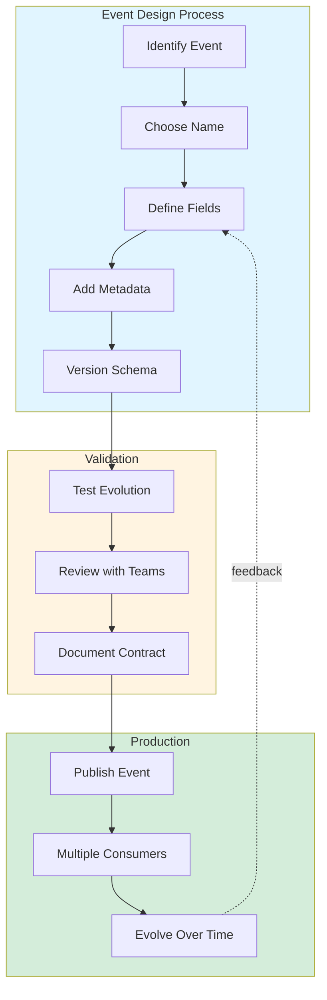

# Exercise 4.01: Event Design Patterns - Good vs Bad

## Learning Objectives

- Design production-ready event schemas
- Understand schema evolution and versioning strategies
- Avoid breaking changes in distributed systems
- Apply the envelope pattern for metadata
- Learn field naming conventions and best practices
- Design events for multi-team environments
- Understand trade-offs between rich and minimal events

## What You'll Learn

This is a **kata-style exercise** focused on critical thinking and design decisions. You'll:
1. Analyze 5 event examples (some good, some problematic)
2. Critique design decisions
3. Redesign events to follow best practices
4. Implement improved versions in code
5. Test schema evolution scenarios

## Prerequisites

- Completed exercises 1.01-3.06 (Kafka fundamentals, Schema Registry, and Kafka Connect)
- Docker and Docker Compose installed
- Understanding of JSON and data modeling
- Basic knowledge of API design principles

## Background

### Why Event Design Matters

In event-driven architectures:
- **Events are contracts** between services
- **Breaking changes** can cause production incidents
- **Poor naming** creates confusion across teams
- **Missing context** forces complex joins
- **Schema evolution** must be carefully managed

A well-designed event enables:
- Multiple consumers with different needs
- Schema evolution without breaking changes
- Clear business intent and semantics
- Efficient debugging and auditing
- Long-term maintainability

### Common Anti-Patterns

1. **Technical names instead of business names**
2. **Missing timestamps or correlation IDs**
3. **Deeply nested structures that change frequently**
4. **Abbreviations and unclear field names**
5. **No versioning strategy**
6. **Mixing commands and events**
7. **Including too much or too little context**

## Architecture



## Tasks

### Task 1: Start the Environment

Start Kafka with Schema Registry:

```bash
docker compose up -d
```

Wait 30 seconds for all services to start.

### Task 2: Examine Bad Event Example #1 - Technical Names

Open `bad-examples/01-technical-names.json`:

```json
{
  "usr_id": 12345,
  "ts": 1701619200000,
  "stat": "A",
  "amt": 99.99,
  "curr": "USD"
}
```

**Problems:**
- Abbreviations are unclear (`usr_id`, `ts`, `stat`, `amt`, `curr`)
- No event type or version
- No business context (what happened?)
- Timestamp is a number (unclear if seconds or milliseconds)
- No correlation ID for tracing

**Discussion Questions:**
1. What does `stat: "A"` mean? Active? Approved? Assigned?
2. Can you understand this event without reading documentation?
3. What happens when a new developer joins?

### Task 3: Redesign Example #1 - Use Business Names

Create a better version in `good-examples/01-business-names.json`:

```json
{
  "eventType": "OrderPlaced",
  "eventVersion": "1.0.0",
  "eventId": "550e8400-e29b-41d4-a716-446655440000",
  "eventTimestamp": "2024-12-03T10:00:00Z",
  "correlationId": "order-session-abc123",
  
  "orderId": "order-12345",
  "customerId": "customer-67890",
  "orderStatus": "pending",
  "totalAmount": 99.99,
  "currency": "USD"
}
```

**Improvements:**
- Clear, descriptive field names
- Event metadata in envelope pattern
- ISO 8601 timestamp
- UUIDs for IDs
- Self-documenting

### Task 4: Examine Bad Event Example #2 - Missing Context

Open `bad-examples/02-missing-context.json`:

```json
{
  "eventType": "StatusChanged",
  "newStatus": "shipped"
}
```

**Problems:**
- What entity's status changed? (Order? User? Payment?)
- No previous status (can't understand state transition)
- Missing timestamp (when did it happen?)
- No actor information (who/what caused the change?)
- No reason for the change

**Discussion Questions:**
1. Can a consumer replay this event and understand what happened?
2. What queries would be impossible without more context?
3. How would you debug issues with just this data?

### Task 5: Redesign Example #2 - Rich Context

Create `good-examples/02-rich-context.json`:

```json
{
  "eventType": "OrderStatusChanged",
  "eventVersion": "1.0.0",
  "eventId": "660e8400-e29b-41d4-a716-446655440001",
  "eventTimestamp": "2024-12-03T10:15:00Z",
  "correlationId": "order-session-abc123",
  
  "orderId": "order-12345",
  "customerId": "customer-67890",
  "
Status": "pending",
  "newStatus": "shipped",
  "changedBy": "shipping-service",
  "reason": "package_handed_to_carrier",
  "carrier": "FedEx",
  "trackingNumber": "1234567890",
  
  "orderDetails": {
    "totalAmount": 99.99,
    "currency": "USD",
    "itemCount": 3
  }
}
```

**Improvements:**
- Clear entity identification (orderId)
- State transition visible (previous + new status)
- Actor information (who made the change)
- Business reason provided
- Related context included (tracking number)
- Customer ID enables correlation

### Task 6: Examine Bad Event Example #3 - Nested Nightmare

Open `bad-examples/03-deeply-nested.json`:

```json
{
  "order": {
    "header": {
      "meta": {
        "data": {
          "id": 123,
          "info": {
            "customer": {
              "details": {
                "name": "John"
              }
            }
          }
        }
      }
    }
  }
}
```

**Problems:**
- Unnecessary nesting makes access difficult
- Schema changes at deep levels break consumers
- Unclear structure - why so many levels?
- Hard to query and index
- Inefficient serialization

**Discussion Questions:**
1. How would you access the customer name in code?
2. What happens if you need to add a field at level 3?
3. Is this nesting providing any value?

### Task 7: Redesign Example #3 - Flat and Clear

Create `good-examples/03-flat-structure.json`:

```json
{
  "eventType": "OrderCreated",
  "eventVersion": "1.0.0",
  "eventId": "770e8400-e29b-41d4-a716-446655440002",
  "eventTimestamp": "2024-12-03T10:30:00Z",
  
  "orderId": "order-123",
  "customerId": "customer-456",
  "customerName": "John Doe",
  "customerEmail": "john@example.com",
  
  "items": [
    {
      "productId": "prod-001",
      "productName": "Laptop",
      "quantity": 1,
      "unitPrice": 999.99
    }
  ],
  
  "totalAmount": 999.99,
  "currency": "USD",
  "shippingAddress": {
    "street": "123 Main St",
    "city": "Boston",
    "country": "US"
  }
}
```

**Improvements:**
- Flat top-level structure
- Group related fields (address) minimally
- Arrays for collections (items)
- Easy to access and query
- Clear boundaries

### Task 8: Examine Bad Event Example #4 - No Versioning

Open `bad-examples/04-no-version.json`:

```json
{
  "type": "UserUpdate",
  "userId": 123,
  "name": "Alice"
}
```

**Problems:**
- No version field - can't evolve schema safely
- Adding fields might break consumers
- No way to know which schema version to expect
- Can't run multiple versions simultaneously
- Difficult to migrate consumers

**Discussion Questions:**
1. What happens when you need to add a mandatory field?
2. How do old consumers handle new fields?
3. How do you deprecate old versions?

### Task 9: Redesign Example #4 - Versioned Schema

Create `good-examples/04-versioned-schema.json`:

Version 1.0.0:
```json
{
  "eventType": "UserProfileUpdated",
  "eventVersion": "1.0.0",
  "eventId": "880e8400-e29b-41d4-a716-446655440003",
  "eventTimestamp": "2024-12-03T10:45:00Z",
  
  "userId": "user-123",
  "userName": "Alice",
  "userEmail": "alice@example.com"
}
```

Version 2.0.0 (backward compatible):
```json
{
  "eventType": "UserProfileUpdated",
  "eventVersion": "2.0.0",
  "eventId": "990e8400-e29b-41d4-a716-446655440004",
  "eventTimestamp": "2024-12-03T10:50:00Z",
  
  "userId": "user-123",
  "userName": "Alice",
  "userEmail": "alice@example.com",
  "phoneNumber": "+1-555-0123",
  "preferences": {
    "newsletter": true,
    "notifications": true
  }
}
```

**Improvements:**
- Explicit version field
- Semantic versioning (major.minor.patch)
- New fields are optional (backward compatible)
- Consumers can handle multiple versions
- Migration path is clear

### Task 10: Examine Bad Event Example #5 - Command vs Event

Open `bad-examples/05-command-not-event.json`:

```json
{
  "action": "createOrder",
  "shouldValidate": true,
  "pleaseNotify": true,
  "mustSucceed": true
}
```

**Problems:**
- This is a command, not an event!
- Commands tell systems what to do (future)
- Events tell what happened (past)
- Mixing these creates confusion
- Unclear ownership and flow

**Discussion Questions:**
1. Is this describing a request or a fact?
2. Who is responsible for handling this?
3. What if the action fails?

### Task 11: Redesign Example #5 - Past Tense Events

Create `good-examples/05-proper-event.json`:

```json
{
  "eventType": "OrderCreated",
  "eventVersion": "1.0.0",
  "eventId": "aa0e8400-e29b-41d4-a716-446655440005",
  "eventTimestamp": "2024-12-03T11:00:00Z",
  "correlationId": "api-request-xyz789",
  
  "orderId": "order-789",
  "customerId": "customer-456",
  "wasValidated": true,
  "notificationSent": true,
  "totalAmount": 149.99,
  "currency": "USD",
  
  "metadata": {
    "source": "web-app",
    "sourceVersion": "2.3.1",
    "userId": "admin-001"
  }
}
```

**Improvements:**
- Past tense name (OrderCreated, not CreateOrder)
- Describes what happened, not what should happen
- Includes outcome (wasValidated, notificationSent)
- Source attribution in metadata
- Immutable fact

### Task 12: Implement Event Producer

Create a producer that sends well-designed events:

```bash
cd event-producer
go mod download
```

Examine `main.go` - it produces events following best practices:
- Envelope pattern for metadata
- Versioning
- Correlation IDs
- Business names
- Rich context

Run it:

```bash
go run main.go
```

### Task 13: Implement Event Validator

Create a consumer that validates event quality:

```bash
cd event-validator
go mod download
```

This consumer checks events for:
- Required envelope fields
- Proper naming (past tense, PascalCase)
- Timestamp format
- Version format
- ID formats (UUID)

Run it:

```bash
go run main.go
```

It will score events and provide feedback.

### Task 14: Test Schema Evolution

Produce events with different versions:

```bash
cd ../event-producer
EVENT_VERSION=1.0.0 go run main.go
EVENT_VERSION=2.0.0 go run main.go
```

Watch the validator handle both versions gracefully.

### Task 15: View Events in Kafka UI

Open http://localhost:8080

1. Navigate to "Topics" → "events"
2. View the messages
3. Notice the consistent structure
4. Compare timestamps, IDs, and versions

### Task 16: Implement Envelope Pattern

Examine `schemas/event-envelope.avsc`:

```json
{
  "type": "record",
  "name": "EventEnvelope",
  "namespace": "com.example.events",
  "fields": [
    {"name": "eventType", "type": "string"},
    {"name": "eventVersion", "type": "string"},
    {"name": "eventId", "type": "string"},
    {"name": "eventTimestamp", "type": "string"},
    {"name": "correlationId", "type": ["null", "string"], "default": null},
    {"name": "causationId", "type": ["null", "string"], "default": null},
    {"name": "payload", "type": "string"}
  ]
}
```

This separates metadata from business data.

### Task 17: Design Your Own Events

Create events for these scenarios following best practices:

1. **User Registration**
   - Include all relevant context
   - Use proper naming
   - Add metadata envelope

2. **Payment Processed**
   - Include previous and new state
   - Add actor information
   - Include relevant amounts and IDs

3. **Inventory Updated**
   - Show quantity changes
   - Include reason for update
   - Add warehouse/location info

Document your decisions in `my-events/README.md`.

### Task 18: Critique Session

Exchange events with a colleague and critique:
- Field naming clarity
- Appropriate context
- Versioning strategy
- Evolution path
- Missing information

### Task 19: Evolution Scenarios

Test these schema evolution scenarios:

**Backward Compatible:**
- Add optional field
- Remove field (consumers ignore missing)
- Add enum value

**Forward Compatible:**
- Consumer handles unknown fields
- Ignore new event types

**Breaking Changes:**
- Rename field
- Change field type
- Make optional field required

Document which require coordination.

### Task 20: Best Practices Checklist

Review your events against this checklist:

**Naming:**
- [ ] Event type in PascalCase (OrderCreated, not order_created)
- [ ] Past tense (UserRegistered, not RegisterUser)
- [ ] Business language (not technical jargon)
- [ ] No abbreviations (userId, not usr_id)

**Metadata Envelope:**
- [ ] eventType
- [ ] eventVersion (semantic versioning)
- [ ] eventId (UUID)
- [ ] eventTimestamp (ISO 8601)
- [ ] correlationId
- [ ] causationId (optional)

**Content:**
- [ ] Entity ID included
- [ ] Sufficient context for understanding
- [ ] State transitions show previous and new
- [ ] Actor/source identified
- [ ] Reason or cause included where relevant

**Schema:**
- [ ] Flat structure (minimal nesting)
- [ ] Optional new fields for evolution
- [ ] Documented schema in Schema Registry
- [ ] Version increment follows semver

**Technical:**
- [ ] Valid JSON/Avro
- [ ] Consistent field types
- [ ] Appropriate data types (not all strings)
- [ ] No sensitive data (PII masked)

## Key Concepts

### The Envelope Pattern

Separate metadata from business data:

```
┌─────────────────────────────────┐
│ Envelope (standardized)         │
│ - eventType                     │
│ - eventVersion                  │
│ - eventId                       │
│ - eventTimestamp                │
│ - correlationId                 │
├─────────────────────────────────┤
│ Payload (business-specific)     │
│ - orderId                       │
│ - customerId                    │
│ - items                         │
│ - ...                           │
└─────────────────────────────────┘
```

Benefits:
- Consistent metadata across all events
- Easy to add cross-cutting concerns
- Standard tooling for routing/filtering
- Business data evolves independently

### Semantic Versioning

**MAJOR.MINOR.PATCH** (e.g., 2.3.1)

- **MAJOR**: Breaking changes (rename field, change type)
- **MINOR**: Backward-compatible additions (new optional field)
- **PATCH**: Bug fixes in documentation/description

Example:
- `1.0.0` → Initial release
- `1.1.0` → Added optional "phoneNumber" field
- `2.0.0` → Renamed "userName" to "fullName" (breaking!)

### Commands vs Events

**Commands** (imperative, future):
- CreateOrder
- UpdateInventory
- SendEmail
- Can fail
- Request for action

**Events** (declarative, past):
- OrderCreated
- InventoryUpdated
- EmailSent
- Already happened
- Immutable fact

### Rich vs Minimal Events

**Rich Events** (fat events):
```json
{
  "eventType": "OrderPlaced",
  "orderId": "123",
  "customerId": "456",
  "customerName": "John",
  "customerEmail": "john@example.com",
  "items": [...],
  "totalAmount": 99.99
}
```

**Minimal Events** (thin events):
```json
{
  "eventType": "OrderPlaced",
  "orderId": "123"
}
```

**Trade-offs:**

Rich Events:
- ✅ Self-contained, no lookups needed
- ✅ Easier for consumers
- ✅ Better for analytics
- ❌ Larger message size
- ❌ Schema changes affect more consumers

Minimal Events:
- ✅ Smaller messages
- ✅ Less coupling
- ❌ Consumers must fetch related data
- ❌ More complex consumer logic

**Recommendation**: Include commonly needed context, but not everything.

### Context Inclusion Guidelines

**Always Include:**
- Entity IDs (orderId, customerId)
- Timestamps
- State transitions (previous + new state)
- Actor/source information

**Usually Include:**
- Commonly queried fields
- Data needed for business logic
- Correlation context

**Sometimes Include:**
- Large nested objects
- Derived/calculated data
- Historical data

**Never Include:**
- Sensitive PII (unless encrypted)
- Entire object graphs
- Temporary/session data

## Best Practices Summary

### Naming Conventions

```
✅ Good Event Names:
- OrderPlaced
- PaymentProcessed
- UserRegistered
- InventoryUpdated
- ShipmentDispatched

❌ Bad Event Names:
- CreateOrder (command, not event)
- order_update (not PascalCase)
- Update (too vague)
- usr_reg (abbreviations)
```

### Field Naming

```
✅ Good Field Names:
- customerId
- orderTimestamp
- totalAmount
- shippingAddress

❌ Bad Field Names:
- cust_id (abbreviation)
- ts (unclear)
- amt (abbreviation)
- addr (abbreviation)
```

### Version Evolution

```
Version 1.0.0:
{
  "userId": "123",
  "userName": "Alice"
}

Version 1.1.0 (backward compatible):
{
  "userId": "123",
  "userName": "Alice",
  "userEmail": "alice@example.com"  // optional field added
}

Version 2.0.0 (breaking change):
{
  "userId": "123",
  "fullName": "Alice Smith",  // renamed from userName
  "email": "alice@example.com"
}
```

### Metadata Standards

Every event should have:
```json
{
  "eventType": "string (PascalCase, past tense)",
  "eventVersion": "string (semver: X.Y.Z)",
  "eventId": "string (UUID v4)",
  "eventTimestamp": "string (ISO 8601 with timezone)",
  "correlationId": "string (trace requests across services)",
  "causationId": "string (which event caused this one)"
}
```

## Common Pitfalls

1. **Using database column names** instead of business names
2. **Including null values** (use optional fields instead)
3. **Changing field semantics** without version bump
4. **No schema documentation** (use Schema Registry!)
5. **Mixing concerns** (authentication data in business events)
6. **Timestamps without timezone** (always use ISO 8601 with Z)
7. **No correlation IDs** (impossible to trace)
8. **Generic event names** (Updated, Changed, Modified)
9. **Nested complexity** (more than 2-3 levels deep)
10. **Forgetting tombstones** (for compacted topics)

## Anti-Pattern Examples

### Anti-Pattern: Database Table Dump

```json
// ❌ DON'T: Expose database structure
{
  "table": "orders",
  "row_id": 123,
  "col_status": "A",
  "col_cust_fk": 456,
  "created_ts": 1701619200,
  "updated_ts": 1701619200
}

// ✅ DO: Use business language
{
  "eventType": "OrderCreated",
  "orderId": "order-123",
  "customerId": "customer-456",
  "orderStatus": "pending",
  "createdAt": "2024-12-03T10:00:00Z"
}
```

### Anti-Pattern: Everything Is a String

```json
// ❌ DON'T: Lose type information
{
  "amount": "99.99",
  "quantity": "5",
  "isActive": "true",
  "timestamp": "1701619200000"
}

// ✅ DO: Use appropriate types
{
  "amount": 99.99,
  "quantity": 5,
  "isActive": true,
  "timestamp": "2024-12-03T10:00:00Z"
}
```

### Anti-Pattern: Missing Context

```json
// ❌ DON'T: Force consumers to look up everything
{
  "eventType": "StatusChanged",
  "id": 123,
  "newValue": "shipped"
}

// ✅ DO: Include relevant context
{
  "eventType": "OrderShipped",
  "orderId": "order-123",
  "customerId": "customer-456",
  "previousStatus": "processing",
  "newStatus": "shipped",
  "carrier": "FedEx",
  "trackingNumber": "1Z999AA1234567890"
}
```

## Troubleshooting

**Schema evolution breaks consumers:**
- Use semantic versioning
- Test with both old and new schemas
- Deprecate gradually with warnings
- Document migration path

**Events too large:**
- Remove unnecessary nested objects
- Reference large data by ID
- Use compression
- Consider event size limits (1MB default)

**Unclear event semantics:**
- Use domain-driven design language
- Get input from business stakeholders
- Document in Schema Registry
- Provide examples

**Version conflicts:**
- Coordinate major version changes
- Run multiple versions in parallel
- Use feature flags for migrations
- Monitor version distribution

## Additional Exercises

1. **Event Storming Session**: Map out events for an e-commerce domain
2. **Schema Migration**: Plan a breaking change migration
3. **Multi-Service Flow**: Design events for order → payment → shipping flow
4. **Analytics Events**: Design events optimized for data warehouse
5. **Audit Trail**: Design events for compliance and auditing
6. **Error Events**: Design events for failures and compensating actions
7. **Saga Pattern**: Design events for distributed transactions

## Resources

- [CloudEvents Specification](https://cloudevents.io/)
- [AsyncAPI Specification](https://www.asyncapi.com/)
- [Domain-Driven Design](https://martinfowler.com/bliki/DomainDrivenDesign.html)
- [Schema Evolution in Avro](https://docs.confluent.io/platform/current/schema-registry/avro.html)
- [Event Sourcing](https://martinfowler.com/eaaDev/EventSourcing.html)
- [Semantic Versioning](https://semver.org/)
- [Google JSON Style Guide](https://google.github.io/styleguide/jsoncstyleguide.xml)
