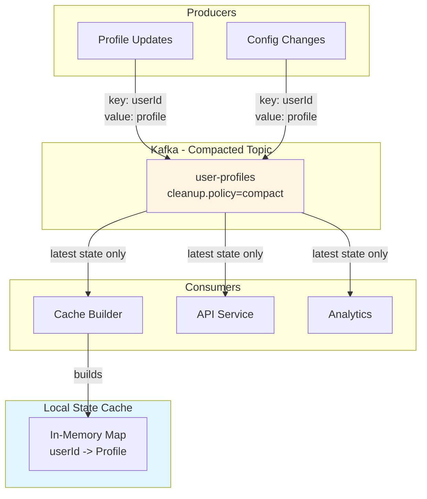

# Exercise 4.02: Compacted Topics as State Store

## Learning Objectives

- Understand log compaction in Kafka
- Use compacted topics as distributed state stores
- Implement change data capture (CDC) patterns
- Handle tombstone records for deletions
- Build a local cache from compacted topics
- Understand idempotent updates and key-based partitioning

## What You'll Build

In this exercise, you'll create:
1. **User Profile Store**: A compacted topic storing user profiles
2. **Producer**: Updates user profiles with latest state
3. **Consumer**: Builds a local cache from the compacted topic
4. **State Viewer**: Queries the current state of all users
5. **Deletion Handler**: Removes users using tombstone records

## Prerequisites

- Completed exercises 1.01-4.01 (Kafka fundamentals through Event Design)
- Docker and Docker Compose installed
- Basic understanding of Kafka topics and consumers
- Go 1.21 or later installed (for sample applications)

## Background

### What is Log Compaction?

**Normal Kafka topics** retain all messages for a time period:
```
Key: user-1 | Value: {name: "Alice", age: 25}
Key: user-1 | Value: {name: "Alice", age: 26}  <- Updates the previous
Key: user-1 | Value: {name: "Alice", age: 27}  <- Updates again
```
All three messages are retained until TTL expires.

**Compacted topics** retain only the latest value for each key:
```
Key: user-1 | Value: {name: "Alice", age: 27}  <- Only latest kept
```
Older messages with the same key are eventually removed.

### Use Cases

1. **State Stores**: User profiles, product catalogs, configuration
2. **Change Data Capture**: Database table snapshots
3. **Caching**: Distributed cache with Kafka as the backing store
4. **Event Sourcing**: Snapshot of current state from event stream
5. **Configuration Management**: Latest config values for services

## Architecture



### How Compaction Works

1. **Write**: All writes go to the active segment
2. **Compaction**: Background process compacts old segments
3. **Retention**: Keeps only the latest value per key
4. **Tombstones**: `null` values delete the key
5. **Min Compaction Lag**: Configurable delay before compaction

## Tasks

### Task 1: Start the Environment

Start Kafka:

```bash
docker compose up -d
```

Wait about 10 seconds for Kafka to be ready.

### Task 2: Create a Compacted Topic

Create a topic with log compaction enabled:

```bash
docker exec -it kafka /opt/kafka/bin/kafka-topics.sh \
  --create \
  --topic user-profiles \
  --bootstrap-server localhost:9092 \
  --partitions 3 \
  --replication-factor 1 \
  --config cleanup.policy=compact \
  --config min.cleanable.dirty.ratio=0.01 \
  --config segment.ms=10000 \
  --config delete.retention.ms=100
```

Key configurations:
- `cleanup.policy=compact`: Enable log compaction
- `min.cleanable.dirty.ratio=0.01`: Compact when 1% of log is "dirty" (has duplicates)
- `segment.ms=10000`: Create new segment every 10 seconds (faster compaction for demo)
- `delete.retention.ms=100`: Tombstones retained for 100ms

### Task 3: Verify Topic Configuration

Check the topic settings:

```bash
docker exec -it kafka /opt/kafka/bin/kafka-topics.sh \
  --describe \
  --topic user-profiles \
  --bootstrap-server localhost:9092
```

You should see the compaction configuration.

### Task 4: Produce Initial User Profiles

Let's create some user profiles:

```bash
docker exec -it kafka /opt/kafka/bin/kafka-console-producer.sh \
  --topic user-profiles \
  --bootstrap-server localhost:9092 \
  --property "parse.key=true" \
  --property "key.separator=:"
```

Enter these user profiles (press Ctrl+D when done):
```
user-1:{"userId": "user-1", "name": "Alice", "email": "alice@example.com", "age": 25, "version": 1}
user-2:{"userId": "user-2", "name": "Bob", "email": "bob@example.com", "age": 30, "version": 1}
user-3:{"userId": "user-3", "name": "Charlie", "email": "charlie@example.com", "age": 35, "version": 1}
user-4:{"userId": "user-4", "name": "Diana", "email": "diana@example.com", "age": 28, "version": 1}
user-5:{"userId": "user-5", "name": "Eve", "email": "eve@example.com", "age": 32, "version": 1}
```

### Task 5: Read All Current State

Consume from the beginning to see all messages:

```bash
docker exec -it kafka /opt/kafka/bin/kafka-console-consumer.sh \
  --topic user-profiles \
  --bootstrap-server localhost:9092 \
  --from-beginning \
  --property print.key=true \
  --property key.separator=" => " \
  --timeout-ms 5000
```

You should see 5 user profiles.

### Task 6: Update User Profiles

Now let's update some users (produce updates with the same keys):

```bash
docker exec -it kafka /opt/kafka/bin/kafka-console-producer.sh \
  --topic user-profiles \
  --bootstrap-server localhost:9092 \
  --property "parse.key=true" \
  --property "key.separator=:"
```

Enter updates:
```
user-1:{"userId": "user-1", "name": "Alice Smith", "email": "alice.smith@example.com", "age": 26, "version": 2}
user-2:{"userId": "user-2", "name": "Bob Jones", "email": "bob.jones@example.com", "age": 31, "version": 2}
user-1:{"userId": "user-1", "name": "Alice Smith", "email": "alice.smith@example.com", "age": 27, "version": 3}
```

Press Ctrl+D to finish.

### Task 7: Observe Before Compaction

Consume again from the beginning:

```bash
docker exec -it kafka /opt/kafka/bin/kafka-console-consumer.sh \
  --topic user-profiles \
  --bootstrap-server localhost:9092 \
  --from-beginning \
  --property print.key=true \
  --property key.separator=" => " \
  --timeout-ms 5000
```

You should see **8 messages** (5 original + 3 updates). All versions are still present because compaction hasn't run yet.

### Task 8: Trigger Compaction

Compaction runs in the background, but we can force it by:

1. Produce more data to create new segments:
```bash
for i in {6..10}; do
  echo "user-$i:{\"userId\": \"user-$i\", \"name\": \"User$i\", \"email\": \"user$i@example.com\", \"age\": 25, \"version\": 1}" | \
  docker exec -i kafka /opt/kafka/bin/kafka-console-producer.sh \
    --topic user-profiles \
    --bootstrap-server localhost:9092 \
    --property "parse.key=true" \
    --property "key.separator=:"
done
```

2. Wait 30-60 seconds for compaction to run.

3. Check compaction logs:
```bash
docker logs kafka 2>&1 | grep -i "compact\|cleaner"
```

### Task 9: Verify Compaction

After waiting, consume again:

```bash
docker exec -it kafka /opt/kafka/bin/kafka-console-consumer.sh \
  --topic user-profiles \
  --bootstrap-server localhost:9092 \
  --from-beginning \
  --property print.key=true \
  --property key.separator=" => " \
  --timeout-ms 5000
```

You should now see **10 messages** instead of 13:
- `user-1`: Only version 3 (latest)
- `user-2`: Only version 2 (latest)
- `user-3` through `user-10`: Version 1 (only version)

The older versions of `user-1` and `user-2` have been compacted away!

### Task 10: Understand the State Store Pattern

Build the Go application that demonstrates the state store pattern:

```bash
cd state-store
go mod download
```

Examine `main.go` to understand:
1. **Consumer**: Reads all messages from the beginning
2. **Local Cache**: Builds an in-memory map of userId → Profile
3. **Updates**: Overwrites old values with new ones (same key)
4. **Query**: Provides current state snapshot

### Task 11: Run the State Store Consumer

Start the state store consumer:

```bash
go run main.go
```

You should see:
- Consumer starting and reading from the beginning
- Building local cache from all messages
- Current state snapshot showing latest values for each user
- Consumer continues running, updating cache with new changes

Keep it running for the next tasks.

### Task 12: Update Profiles While Consumer Runs

In a new terminal, update a user profile:

```bash
echo 'user-1:{"userId": "user-1", "name": "Alice Johnson", "email": "alice.j@example.com", "age": 28, "version": 4}' | \
docker exec -i kafka /opt/kafka/bin/kafka-console-producer.sh \
  --topic user-profiles \
  --bootstrap-server localhost:9092 \
  --property "parse.key=true" \
  --property "key.separator=:"
```

Watch the consumer terminal - it should update the cache in real-time!

### Task 13: Implement Tombstone Deletions

To delete a user from the state store, send a `null` value (tombstone):

```bash
echo "user-5:NULL" | \
docker exec -i kafka /opt/kafka/bin/kafka-console-producer.sh \
  --topic user-profiles \
  --bootstrap-server localhost:9092 \
  --property "parse.key=true" \
  --property "key.separator=:" \
  --property "null.marker=NULL"
```

The consumer should remove `user-5` from its cache.

### Task 14: Build the Query Service

Examine `query-service/main.go` - it provides an HTTP API for querying the state:

```bash
cd query-service
go run main.go
```

This starts an HTTP server on port 8090.

### Task 15: Query the State Store

In another terminal, query the state:

```bash
# Get all users
curl http://localhost:8090/users

# Get specific user
curl http://localhost:8090/users/user-1

# Get user count
curl http://localhost:8090/users/count
```

The API serves data from the local cache built from the compacted topic!

### Task 16: Test State Rebuild

Stop the query service (Ctrl+C) and restart it:

```bash
go run main.go
```

Notice:
1. It reads from the beginning of the topic
2. Rebuilds the entire state cache
3. Serves the latest state immediately

This demonstrates **fault tolerance** - the state can always be rebuilt from Kafka.

### Task 17: Multiple Consumers

Start a second instance of the query service on a different port:

```bash
PORT=8091 go run main.go
```

Both instances:
- Read the same compacted topic
- Build identical local caches
- Can serve requests independently
- Stay in sync automatically

This is **scalability** through Kafka-backed state.

### Task 18: Observe Partition Compaction

Check which partitions have been compacted:

```bash
docker exec -it kafka /opt/kafka/bin/kafka-log-dirs.sh \
  --bootstrap-server localhost:9092 \
  --topic-list user-profiles \
  --describe | python3 -m json.tool
```

Look for `size` differences between partitions.

### Task 19: Test Key Distribution

Produce users with specific keys to see partition assignment:

```bash
docker exec -it kafka /opt/kafka/bin/kafka-console-producer.sh \
  --topic user-profiles \
  --bootstrap-server localhost:9092 \
  --property "parse.key=true" \
  --property "key.separator=:"
```

Enter:
```
test-a:{"userId": "test-a", "name": "Test A", "partition": "?"}
test-b:{"userId": "test-b", "name": "Test B", "partition": "?"}
test-c:{"userId": "test-c", "name": "Test C", "partition": "?"}
```

Then consume with partition info:

```bash
docker exec -it kafka /opt/kafka/bin/kafka-console-consumer.sh \
  --topic user-profiles \
  --bootstrap-server localhost:9092 \
  --from-beginning \
  --property print.key=true \
  --property print.partition=true \
  --timeout-ms 3000 | tail -3
```

Same keys always go to the same partition (important for compaction!).

### Task 20: Clean Up

Stop all running services (Ctrl+C).

Stop Docker containers:

```bash
docker compose down
```

## Key Concepts

### Log Compaction vs. Retention

**Retention-based cleanup** (default):
- Deletes old messages after time/size threshold
- Good for: Event logs, time-series data
- Example: "Keep 7 days of order events"

**Compaction-based cleanup**:
- Keeps latest value for each key
- Good for: State stores, snapshots, CDC
- Example: "Current user profile for each user"

### Compaction Guarantees

1. **At least one message per key**: Latest value always retained
2. **Eventual consistency**: Compaction happens asynchronously
3. **Ordering per key**: Messages with same key maintain order
4. **Tombstone lifecycle**: Null values mark deletions

### State Store Pattern

```
Producer → Compacted Topic → Consumer → Local Cache
    ↓                            ↓
  Updates                    Queries
  (write-through)            (read from cache)
```

Benefits:
- Fast local reads (in-memory cache)
- Durable state (backed by Kafka)
- Fault tolerance (rebuild from topic)
- Scalability (multiple consumers)

### Tombstone Records

A message with `key="user-5"` and `value=null`:
- Marks the key for deletion
- Retained briefly (delete.retention.ms)
- Eventually removed by compaction
- Consumers should delete from cache

### Idempotency

Compaction works best with **idempotent updates**:
- Same key + same value = same result
- Latest value always represents current state
- Updates are not cumulative

Example:
```json
// Good (idempotent)
{"userId": "user-1", "balance": 100}  // Absolute value

// Bad (not idempotent)
{"userId": "user-1", "balanceDelta": +10}  // Relative change
```

## Configuration Parameters

### Topic-Level Settings

```bash
cleanup.policy=compact                  # Enable compaction
min.cleanable.dirty.ratio=0.5          # Compact when 50% dirty
segment.ms=604800000                   # 7 days (new segment)
delete.retention.ms=86400000           # Tombstone retention (1 day)
min.compaction.lag.ms=0                # Minimum age before compaction
max.compaction.lag.ms=9223372036854775807  # Maximum age before forced compaction
```

### Broker-Level Settings

```properties
log.cleaner.enable=true                # Enable compaction (default)
log.cleaner.threads=1                  # Compaction thread count
log.cleaner.io.max.bytes.per.second=1.7976931348623157E308  # I/O throttle
log.cleaner.dedupe.buffer.size=134217728  # 128MB dedup buffer
```

## Best Practices

1. **Choose appropriate keys**: User IDs, entity IDs, unique identifiers
2. **Set min.cleanable.dirty.ratio carefully**: Lower = more frequent compaction
3. **Use tombstones for deletions**: Don't forget to clean up deleted entities
4. **Monitor compaction lag**: Ensure compaction keeps up with writes
5. **Plan partition count**: More partitions = better parallelism
6. **Test rebuild time**: Know how long state recovery takes
7. **Use Schema Registry**: Ensure consistent value formats
8. **Handle null values**: Consumers must recognize tombstones
9. **Consider retention**: Balance storage with recovery time
10. **Monitor storage**: Compacted topics still grow with unique keys

## Troubleshooting

**Compaction not running:**
```bash
# Check if cleaner is enabled
docker exec kafka cat /opt/kafka/config/server.properties | grep log.cleaner

# Check cleaner logs
docker logs kafka 2>&1 | grep LogCleaner

# Verify topic config
docker exec kafka /opt/kafka/bin/kafka-topics.sh \
  --describe --topic user-profiles --bootstrap-server localhost:9092
```

**Old messages not removed:**
- Compaction is eventual (not immediate)
- Need multiple segments (segment.ms)
- Check min.cleanable.dirty.ratio
- Active segment never compacted

**Tombstones not working:**
- Value must be exactly `null`, not empty string
- Check delete.retention.ms
- Consumers must handle null explicitly

**State rebuild too slow:**
- Reduce topic size with more aggressive compaction
- Use snapshots for very large state
- Consider pagination or incremental loads

## Advanced Patterns

### Change Data Capture (CDC)

Use compacted topics to mirror database tables:
```
Database Table          Compacted Topic
--------------          ---------------
user_id | name    →     key: user_id | value: {name: ...}
```

### Configuration Store

```go
// Config changes flow to all services
topic: service-config (compacted)
key: config-key
value: config-json

// Services rebuild config on startup
// React to config changes in real-time
```

### Distributed Cache

```
Write → Kafka (compacted) → All nodes build cache
         ↓
      (Source of truth)
```

### Event Sourcing Snapshots

```
Event Stream (retention) → Aggregate → Snapshot (compacted)
                                          ↓
                                     Fast recovery
```

## Additional Exercises

1. **CDC Pipeline**: Mirror a PostgreSQL table to a compacted topic
2. **Multi-Version State**: Store versioned state with composite keys
3. **Snapshots**: Implement periodic full snapshots
4. **Monitoring Dashboard**: Track compaction lag and storage
5. **Schema Evolution**: Handle profile schema changes
6. **Composite Keys**: Use multiple fields in keys (e.g., "region:userId")
7. **Time-Travel**: Query historical state (pre-compaction)
8. **Benchmark**: Compare compacted vs. standard topics

## Resources

- [Kafka Log Compaction](https://kafka.apache.org/documentation/#compaction)
- [Log Compaction Deep Dive](https://www.confluent.io/blog/kafka-log-compaction/)
- [State Stores with Kafka](https://www.confluent.io/blog/okay-store-data-apache-kafka/)
- [CDC with Kafka](https://debezium.io/)
- [Kafka as a Database](https://www.confluent.io/blog/turning-the-database-inside-out-with-apache-samza/)
