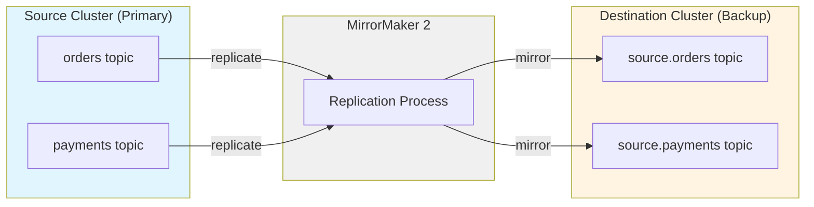

# Exercise 12: Topic Backup with MirrorMaker 2

## Learning Objectives

- Understand Kafka MirrorMaker 2 for cross-cluster replication
- Set up a source and destination Kafka cluster
- Configure MirrorMaker 2 for topic backup
- Monitor replication lag and throughput
- Understand offset translation and consumer group synchronization
- Learn disaster recovery patterns with Kafka

## What You'll Build

In this exercise, you'll create:
1. **Source Cluster**: Primary Kafka cluster with production data
2. **Destination Cluster**: Backup Kafka cluster for disaster recovery
3. **MirrorMaker 2**: Replication connector to mirror topics between clusters
4. **Producer**: Generates continuous data to the source cluster
5. **Consumer**: Reads from both clusters to verify replication

## Prerequisites

- Completed exercises 1-11
- Docker and Docker Compose installed
- Basic understanding of Kafka topics and consumers
- Go 1.21 or later installed (optional, for sample applications)

## Architecture



MirrorMaker 2 features:
- **Topic Replication**: Automatically mirrors topics with prefix
- **Consumer Group Sync**: Replicates consumer offsets
- **ACL Sync**: Mirrors access control lists (when enabled)
- **Exactly-once delivery**: Prevents duplicate messages
- **Automatic failover**: Ready for disaster recovery

## Tasks

### Task 1: Start the Environment

Start both Kafka clusters and MirrorMaker 2:

```bash
docker compose up -d
```

This starts:
- `kafka-source`: Source Kafka cluster (port 9092)
- `kafka-destination`: Destination Kafka cluster (port 9093)
- `mirrormaker2`: MirrorMaker 2 connector
- `kafka-ui`: Web UI for both clusters (port 8080)

Wait about 30 seconds for all services to be ready.

### Task 2: Verify Both Clusters

Check the source cluster:

```bash
docker exec -it kafka-source /opt/kafka/bin/kafka-topics.sh \
  --list \
  --bootstrap-server localhost:9092
```

Check the destination cluster:

```bash
docker exec -it kafka-destination /opt/kafka/bin/kafka-topics.sh \
  --list \
  --bootstrap-server localhost:9093
```

Initially, both should be empty (or have only internal topics).

### Task 3: Create Topics on Source Cluster

Create topics that we'll replicate:

```bash
# Create orders topic
docker exec -it kafka-source /opt/kafka/bin/kafka-topics.sh \
  --create \
  --topic orders \
  --bootstrap-server localhost:9092 \
  --partitions 3 \
  --replication-factor 1

# Create payments topic
docker exec -it kafka-source /opt/kafka/bin/kafka-topics.sh \
  --create \
  --topic payments \
  --bootstrap-server localhost:9092 \
  --partitions 2 \
  --replication-factor 1
```

Verify topics were created:

```bash
docker exec -it kafka-source /opt/kafka/bin/kafka-topics.sh \
  --list \
  --bootstrap-server localhost:9092
```

### Task 4: Understand MirrorMaker 2 Configuration

Examine the MirrorMaker 2 configuration:

```bash
cat mirrormaker2.properties
```

Key configuration elements:
- **clusters**: Defines source and destination clusters
- **source->destination.enabled**: Enables replication direction
- **source->destination.topics**: Regex pattern for topics to replicate
- **replication.factor**: Replication factor for mirrored topics
- **sync.group.offsets.enabled**: Whether to sync consumer groups
- **emit.heartbeats.enabled**: Health check mechanism

### Task 5: Produce Messages to Source Cluster

Generate some order messages:

```bash
docker exec -it kafka-source /opt/kafka/bin/kafka-console-producer.sh \
  --topic orders \
  --bootstrap-server localhost:9092 \
  --property "parse.key=true" \
  --property "key.separator=:"
```

Enter these messages (press Ctrl+D when done):
```
order-1:{"orderId": "order-1", "customerId": "cust-100", "amount": 99.99, "status": "pending"}
order-2:{"orderId": "order-2", "customerId": "cust-101", "amount": 149.50, "status": "pending"}
order-3:{"orderId": "order-3", "customerId": "cust-102", "amount": 299.99, "status": "confirmed"}
order-4:{"orderId": "order-4", "customerId": "cust-100", "amount": 49.99, "status": "shipped"}
order-5:{"orderId": "order-5", "customerId": "cust-103", "amount": 199.00, "status": "delivered"}
```

### Task 6: Wait for Replication

MirrorMaker 2 runs continuously. Wait about 10-15 seconds for replication to occur.

Check MirrorMaker 2 logs:

```bash
docker logs mirrormaker2
```

Look for messages like:
- "Starting connectors and tasks"
- "Committed offset"
- "Replication flow started"

### Task 7: Verify Replicated Topics

Check the destination cluster for mirrored topics:

```bash
docker exec -it kafka-destination /opt/kafka/bin/kafka-topics.sh \
  --list \
  --bootstrap-server localhost:9093
```

You should see:
- `source.orders` (mirrored from source cluster)
- `source.payments` (created but empty)
- `source.heartbeats` (MirrorMaker 2 health check topic)
- `source.checkpoints.internal` (offset sync metadata)

Notice the **"source."** prefix - this helps identify the origin cluster!

### Task 8: Consume from Mirrored Topic

Consume messages from the destination cluster:

```bash
docker exec -it kafka-destination /opt/kafka/bin/kafka-console-consumer.sh \
  --topic source.orders \
  --bootstrap-server localhost:9093 \
  --from-beginning \
  --property print.key=true \
  --property key.separator=" => "
```

You should see all 5 order messages that were produced to the source cluster!

Press Ctrl+C to stop the consumer.

### Task 9: Test Continuous Replication

Let's verify that MirrorMaker 2 continuously replicates new messages.

Produce more messages to the source cluster:

```bash
docker exec -it kafka-source /opt/kafka/bin/kafka-console-producer.sh \
  --topic orders \
  --bootstrap-server localhost:9092 \
  --property "parse.key=true" \
  --property "key.separator=:"
```

Enter:
```
order-6:{"orderId": "order-6", "customerId": "cust-104", "amount": 89.99, "status": "pending"}
order-7:{"orderId": "order-7", "customerId": "cust-105", "amount": 129.99, "status": "confirmed"}
```

Press Ctrl+D to finish.

### Task 10: Verify New Messages Replicated

After 5-10 seconds, consume from the destination again:

```bash
docker exec -it kafka-destination /opt/kafka/bin/kafka-console-consumer.sh \
  --topic source.orders \
  --bootstrap-server localhost:9093 \
  --from-beginning \
  --max-messages 7 \
  --property print.key=true
```

You should see all 7 messages (including the 2 new ones)!

### Task 11: Test Payment Topic Replication

Produce messages to the payments topic:

```bash
docker exec -it kafka-source /opt/kafka/bin/kafka-console-producer.sh \
  --topic payments \
  --bootstrap-server localhost:9092
```

Enter:
```
{"paymentId": "pay-001", "orderId": "order-1", "method": "credit_card", "amount": 99.99}
{"paymentId": "pay-002", "orderId": "order-2", "method": "paypal", "amount": 149.50}
{"paymentId": "pay-003", "orderId": "order-3", "method": "credit_card", "amount": 299.99}
```

Press Ctrl+D to finish.

### Task 12: Monitor Replication Lag

Wait a few seconds, then consume from the mirrored payments topic:

```bash
docker exec -it kafka-destination /opt/kafka/bin/kafka-console-consumer.sh \
  --topic source.payments \
  --bootstrap-server localhost:9093 \
  --from-beginning
```

All payment messages should be replicated!

Press Ctrl+C to stop.

### Task 13: Inspect Replication Metadata

MirrorMaker 2 creates internal topics for tracking replication:

```bash
# View checkpoints (offset mapping)
docker exec -it kafka-destination /opt/kafka/bin/kafka-console-consumer.sh \
  --topic source.checkpoints.internal \
  --bootstrap-server localhost:9093 \
  --from-beginning \
  --max-messages 5
```

This shows how offsets are translated between clusters.

### Task 14: View in Kafka UI

Open http://localhost:8080 in your browser.

The UI is configured to show both clusters:

1. **Source Cluster**:
   - Click on the "source" cluster
   - Navigate to Topics → orders
   - View messages and partitions

2. **Destination Cluster**:
   - Click on the "destination" cluster
   - Navigate to Topics → source.orders
   - Compare with source cluster

3. **Compare**:
   - Notice message counts match
   - Check partition distribution
   - View replication lag (should be minimal)

### Task 15: Understanding Consumer Group Offset Synchronization

> **Important**: MirrorMaker 2 does **not** automatically create consumer groups on the destination cluster. Instead, it creates **checkpoint records** that store the offset translation mapping. This allows consumers to manually find their correct starting position after a failover.

Create a consumer group on the source cluster:

```bash
docker exec -it kafka-source /opt/kafka/bin/kafka-console-consumer.sh \
  --topic orders \
  --bootstrap-server localhost:9092 \
  --group order-processors \
  --from-beginning \
  --max-messages 3
```

This consumes 3 messages and commits the offset.

Wait 60-90 seconds for checkpoint sync (configured by `sync.group.offsets.interval.seconds`).

### Task 16: View Checkpoint Data

MirrorMaker 2 stores offset translation data in the `source.checkpoints.internal` topic on the destination cluster. Check if checkpoints are being written:

```bash
docker exec -it kafka-destination /opt/kafka/bin/kafka-console-consumer.sh \
  --topic source.checkpoints.internal \
  --bootstrap-server localhost:9093 \
  --from-beginning \
  --max-messages 5 2>/dev/null || echo "Checkpoints topic may not exist yet - wait longer for sync"
```

If checkpoints exist, you'll see JSON records mapping source offsets to destination offsets.

### Task 16b: Manual Consumer Group Offset Sync (Disaster Recovery)

During a failover, you need to manually set consumer group offsets on the destination cluster. MirrorMaker 2 provides checkpoint data, but you must apply it:

```bash
# First, check the source consumer group's current offsets
docker exec -it kafka-source /opt/kafka/bin/kafka-consumer-groups.sh \
  --bootstrap-server localhost:9092 \
  --group order-processors \
  --describe
```

Note the current offset for each partition. On the destination cluster, the offsets should be similar (MirrorMaker 2 maintains offset parity when possible).

To manually set offsets on the destination for a new consumer group:

```bash
# Reset to the beginning (for testing) or use --to-offset for specific offset
docker exec -it kafka-destination /opt/kafka/bin/kafka-consumer-groups.sh \
  --bootstrap-server localhost:9093 \
  --group order-processors-dr \
  --topic source.orders \
  --reset-offsets \
  --to-earliest \
  --execute
```

> **Note**: In production, you would use the checkpoint data from `source.checkpoints.internal` to calculate the correct translated offset for each partition.

### Task 17: Simulate Disaster Recovery

Let's simulate a scenario where the source cluster fails and we need to failover.

First, note the current message count in source:

```bash
docker exec -it kafka-source /opt/kafka/bin/kafka-run-class.sh kafka.tools.GetOffsetShell \
  --broker-list localhost:9092 \
  --topic orders
```

Now "fail" the source cluster:

```bash
docker stop kafka-source
```

Produce messages directly to the destination cluster (which is now primary):

```bash
docker exec -it kafka-destination /opt/kafka/bin/kafka-console-producer.sh \
  --topic source.orders \
  --bootstrap-server localhost:9093 \
  --property "parse.key=true" \
  --property "key.separator=:"
```

Enter:
```
order-8:{"orderId": "order-8", "customerId": "cust-106", "amount": 79.99, "status": "pending", "note": "Written during failover"}
```

Consume to verify:

```bash
docker exec -it kafka-destination /opt/kafka/bin/kafka-console-consumer.sh \
  --topic source.orders \
  --bootstrap-server localhost:9093 \
  --from-beginning \
  --max-messages 8
```

### Task 18: Recover Source Cluster

Restart the source cluster:

```bash
docker start kafka-source
```

Wait 10 seconds for it to come back online.

Verify it's working:

```bash
docker exec -it kafka-source /opt/kafka/bin/kafka-topics.sh \
  --list \
  --bootstrap-server localhost:9092
```

Note: In a real disaster recovery scenario, you would:
1. Reconfigure MirrorMaker 2 to replicate from destination → source
2. Sync the messages written during failover
3. Perform a controlled switchback

### Task 19: Monitor MirrorMaker 2 Health

Check the heartbeats topic:

```bash
docker exec -it kafka-destination /opt/kafka/bin/kafka-console-consumer.sh \
  --topic source.heartbeats \
  --bootstrap-server localhost:9093 \
  --from-beginning \
  --max-messages 3
```

Heartbeats confirm MirrorMaker 2 is running and healthy.

### Task 20: Clean Up

Stop all services:

```bash
docker compose down
```

## Key Concepts

### MirrorMaker 2 vs MirrorMaker 1

**MirrorMaker 2** (MM2) improvements:
- Built on Kafka Connect framework
- Automatic topic creation on destination
- Consumer group offset sync
- Bi-directional replication support
- Dynamic configuration updates
- Better monitoring and metrics

**MirrorMaker 1**:
- Simple consumer-producer bridge
- Manual topic creation required
- No offset translation
- Limited monitoring

### Topic Naming Convention

MM2 prefixes topics with the source cluster name:
- Source: `orders` → Destination: `source.orders`
- Source: `payments` → Destination: `source.payments`

This prevents naming conflicts and shows data origin.

### Replication Flow

1. **Source Connector**: Reads from source cluster
2. **Transformation**: Preserves keys, values, headers
3. **Destination Connector**: Writes to destination cluster
4. **Checkpoint**: Records offset mapping
5. **Heartbeat**: Confirms replication is active

### Use Cases

1. **Disaster Recovery**: Backup cluster in different region/datacenter
2. **Data Migration**: Move topics between clusters
3. **Active-Active**: Bi-directional sync for geo-distributed systems
4. **Aggregation**: Combine multiple regional clusters
5. **Analytics**: Replicate production data to analytics cluster

### Offset Translation

MM2 maintains a mapping between source and destination offsets:
- Source offset 0 → Destination offset 0
- Source offset 100 → Destination offset 100

This allows consumers to resume at the correct position after failover.

## Troubleshooting

**Replication not happening:**
```bash
# Check MirrorMaker 2 status
docker logs mirrormaker2

# Verify connectivity
docker exec mirrormaker2 curl http://kafka-source:19092
docker exec mirrormaker2 curl http://kafka-destination:19093

# Check configuration
docker exec mirrormaker2 cat /etc/kafka/mirrormaker2.properties
```

**Messages missing:**
```bash
# Compare message counts
docker exec kafka-source /opt/kafka/bin/kafka-run-class.sh kafka.tools.GetOffsetShell \
  --broker-list localhost:9092 --topic orders

docker exec kafka-destination /opt/kafka/bin/kafka-run-class.sh kafka.tools.GetOffsetShell \
  --broker-list localhost:9093 --topic source.orders
```

**High replication lag:**
- Check network bandwidth between clusters
- Increase `tasks.max` in MM2 configuration
- Monitor consumer lag in MM2 connectors
- Check destination cluster capacity

## Best Practices

1. **Use separate clusters for DR**: Don't replicate to same cluster
2. **Monitor replication lag**: Set up alerts for lag > threshold
3. **Test failover regularly**: Practice disaster recovery procedures
4. **Use topic whitelisting**: Only replicate necessary topics
5. **Configure retention**: Match retention policies between clusters
6. **Enable compression**: Reduce network bandwidth usage
7. **Secure connections**: Use SSL/TLS for cross-datacenter replication
8. **Plan capacity**: Destination cluster needs similar capacity as source

## Advanced Configuration

### Customize Topic Replication

Edit `mirrormaker2.properties`:

```properties
# Replicate specific topics
source->destination.topics = orders, payments, users

# Or use regex
source->destination.topics = prod-.*

# Exclude internal topics
source->destination.topics.exclude = .*internal, .*checkpoint.*
```

### Bi-directional Replication

```properties
# Enable both directions
source->destination.enabled = true
destination->source.enabled = true

# Prevent replication loops
replication.policy.separator = .
```

### Performance Tuning

```properties
# Increase parallelism
tasks.max = 10

# Batch settings
producer.batch.size = 32768
producer.linger.ms = 10

# Compression
producer.compression.type = snappy
```

## Additional Exercises

1. **Bi-directional Sync**: Configure active-active replication
2. **Selective Replication**: Use regex to replicate only specific topics
3. **Custom Prefix**: Change the topic naming convention
4. **Monitoring**: Add Prometheus metrics for replication lag
5. **ACL Sync**: Enable and test ACL replication
6. **Schema Registry**: Replicate Schema Registry along with topics
7. **Exactly-Once**: Configure exactly-once semantics

## Resources

- [Kafka MirrorMaker 2 Documentation](https://cwiki.apache.org/confluence/display/KAFKA/KIP-382%3A+MirrorMaker+2.0)
- [Confluent MirrorMaker 2 Guide](https://docs.confluent.io/platform/current/multi-dc-deployments/replicator/index.html)
- [Disaster Recovery Patterns](https://www.confluent.io/blog/disaster-recovery-multi-datacenter-apache-kafka-deployments/)
- [Offset Translation](https://cwiki.apache.org/confluence/display/KAFKA/KIP-382%3A+MirrorMaker+2.0#KIP382:MirrorMaker2.0-OffsetSync)
