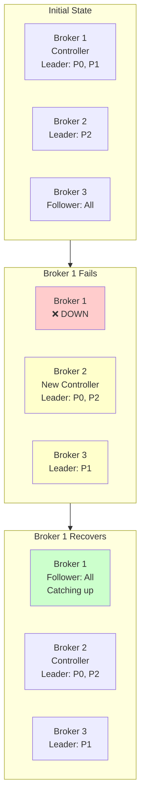

# Exercise 9.01: Chaos Engineering - Broker Failure & Leader Election

## Learning Objectives

- Understand Kafka's replication and fault tolerance
- Observe leader election in action
- Learn about In-Sync Replicas (ISR)
- Test cluster availability during broker failures
- Understand the role of the controller broker
- Practice chaos engineering techniques
- Verify producer and consumer resilience
- Monitor partition reassignment and recovery

## What You'll Build

In this exercise, you'll:
1. **Multi-Broker Cluster**: 3-broker Kafka cluster with replication
2. **Replicated Topics**: Topics with RF=3 for high availability
3. **Chaos Scenarios**: Systematically kill brokers and observe behavior
4. **Monitoring Tools**: Track leader elections and ISR changes
5. **Resilient Applications**: Producers and consumers that handle failures

## Prerequisites

- Completed exercises 1.01-7.06 (Kafka fundamentals through Operations)
- Docker and Docker Compose installed
- Understanding of Kafka replication concepts
- Basic knowledge of distributed systems
- Go 1.21 or later (for test applications)

## Background

### Kafka Replication

Each partition has:
- **Leader**: Handles all reads and writes
- **Followers**: Replicate data from leader
- **ISR (In-Sync Replicas)**: Followers that are caught up

When a leader fails:
1. Controller detects failure (via KRaft metadata)
2. New leader elected from ISR
3. Clients reconnect to new leader
4. Data remains available

### Key Concepts

**Replication Factor (RF)**: Number of replicas per partition
- RF=1: No fault tolerance
- RF=2: Survives 1 broker failure
- RF=3: Survives 2 broker failures (recommended for production)

**Min In-Sync Replicas (min.insync.replicas)**: Minimum replicas that must acknowledge writes
- min.insync.replicas=2 with RF=3: Can lose 1 broker safely
- Balances durability vs. availability

**Controller**: One broker acts as controller
- Manages partition leadership
- Detects broker failures
- Coordinates leader elections

## Architecture



## Tasks

### Task 1: Start Multi-Broker Cluster

Start the 3-broker Kafka cluster:

```bash
docker compose up -d

   **Note**: This cluster uses KRaft mode (no ZooKeeper). All 3 brokers also serve as controllers in the quorum.
```

This starts:
- 3 Kafka brokers (kafka-1, kafka-2, kafka-3) in combined mode (broker + controller)
- Kafka UI for visualization

Wait 30 seconds for cluster initialization.

> You could visit the Kafka ui at http://localhost:8080

### Task 2: Verify Cluster Health

Check all brokers are running:

```bash
docker compose ps
```

All 3 Kafka brokers should be "Up".

List brokers:

```bash
docker exec -it kafka-1 /opt/kafka/bin/kafka-metadata-quorum.sh \
  --bootstrap-server kafka-1:19092 describe --status
```

You should see all 3 brokers listed.

### Task 3: Identify the Active Controller

In KRaft mode, all brokers are controllers. Find the active leader:

```bash
docker exec -it kafka-1 /opt/kafka/bin/kafka-metadata-quorum.sh \
  --bootstrap-server kafka-1:19092 describe --status
```

Look for the `Leader` line to see which broker (1, 2, or 3) is the active controller leader.

Or check in Kafka UI at http://localhost:8080 → Brokers → look for the controller badge.

Remember which broker is the active controller leader!

### Task 4: Create Replicated Topic

Create a topic with replication factor 3:

```bash
docker exec -it kafka-1 /opt/kafka/bin/kafka-topics.sh \
  --create \
  --topic chaos-test \
  --bootstrap-server kafka-1:19092 \
  --partitions 6 \
  --replication-factor 3 \
  --config min.insync.replicas=2
```

Configuration:
- 6 partitions (spread across brokers)
- RF=3 (every partition on all 3 brokers)
- min.insync.replicas=2 (need 2 replicas to write)

### Task 5: Describe Topic Details

Examine partition distribution:

```bash
docker exec -it kafka-1 /opt/kafka/bin/kafka-topics.sh \
  --describe \
  --topic chaos-test \
  --bootstrap-server kafka-1:19092
```

Observe:
- **Leader**: Which broker leads each partition
- **Replicas**: All should show [1,2,3] or similar
- **Isr**: In-Sync Replicas (should equal Replicas initially)

Example output:
```
Topic: chaos-test   Partition: 0   Leader: 2   Replicas: 2,3,1   Isr: 2,3,1
Topic: chaos-test   Partition: 1   Leader: 3   Replicas: 3,1,2   Isr: 3,1,2
Topic: chaos-test   Partition: 2   Leader: 1   Replicas: 1,2,3   Isr: 1,2,3
...
```

Note which partitions each broker leads.

### Task 6: Produce Baseline Data

Produce some messages before chaos:

```bash
for i in {1..100}; do
  echo "baseline-msg-$i:Initial message $i before chaos"
done | docker exec -i kafka-1 /opt/kafka/bin/kafka-console-producer.sh \
  --topic chaos-test \
  --bootstrap-server kafka-1:19092 \
  --property "parse.key=true" \
  --property "key.separator=:"
```

### Task 7: Start Continuous Producer

Start a producer that runs continuously:

```bash
cd producer
go run main.go
```

This produces messages every 100ms. Keep it running in this terminal.

Open a new terminal for the next steps.

### Task 8: Start Consumer

Start a consumer to verify message delivery:

```bash
cd consumer
go run main.go
```

Consumer should receive messages continuously. Keep it running.

Open another new terminal.

### Task 9: Monitor Cluster State

Before causing chaos, take a snapshot:

```bash
# Check under-replicated partitions (should be 0)
docker exec -it kafka-1 /opt/kafka/bin/kafka-topics.sh \
  --describe \
  --under-replicated-partitions \
  --bootstrap-server kafka-1:19092

# Check unavailable partitions (should be none)
docker exec -it kafka-1 /opt/kafka/bin/kafka-topics.sh \
  --describe \
  --unavailable-partitions \
  --bootstrap-server kafka-1:19092
```

**Expected output**: No output (empty) means everything is healthy! When all partitions are fully replicated and available, these commands return nothing.

To verify the cluster is actually working, you can also check all partitions:

```bash
docker exec -it kafka-1 /opt/kafka/bin/kafka-topics.sh \
  --describe \
  --topic chaos-test \
  --bootstrap-server kafka-1:19092
```

Verify that `Isr` matches `Replicas` for all partitions (e.g., both show `1,2,3`).

### Task 10: Scenario 1 - Kill a Follower Broker

Let's start with the easiest scenario: kill a broker that's NOT the controller.

If broker-1 is the controller, kill broker-3:

```bash
docker stop kafka-3
```

If broker-1 is NOT the controller, kill broker-1:

```bash
docker stop kafka-1
```

### Task 11: Observe Producer/Consumer Behavior

Watch both terminal windows:

**Producer:**
- May show brief connection errors
- Should reconnect automatically
- Continues producing successfully
- Some requests may fail during failover (~1-2 seconds)

**Consumer:**
- May pause briefly
- Continues consuming
- No message loss

### Task 12: Check Partition Status

Describe the topic again:

```bash
docker exec -it kafka-2 /opt/kafka/bin/kafka-topics.sh \
  --describe \
  --topic chaos-test \
  --bootstrap-server kafka-2:19094
```

Observe:
- **Leader**: Still assigned (no change if we killed a follower)
- **Replicas**: Still shows all 3 brokers
- **ISR**: Now only shows 2 brokers (missing the failed one)

Example:
```
Topic: chaos-test   Partition: 0   Leader: 2   Replicas: 2,3,1   Isr: 2,1
                                                                    ^^^^ broker 3 removed
```

### Task 13: Check Under-Replicated Partitions

```bash
docker exec -it kafka-2 /opt/kafka/bin/kafka-topics.sh \
  --describe \
  --under-replicated-partitions \
  --bootstrap-server kafka-2:19094
```

You should now see partitions listed! These are under-replicated because one replica is offline.

This is expected and safe with RF=3.

### Task 14: Recover the Failed Broker

Restart the broker:

```bash
docker start kafka-3  # or kafka-1, whichever you stopped
```

Wait 10-15 seconds for it to rejoin.

### Task 15: Observe ISR Recovery

Describe the topic again:

```bash
docker exec -it kafka-1 /opt/kafka/bin/kafka-topics.sh \
  --describe \
  --topic chaos-test \
  --bootstrap-server kafka-1:19092
```

Watch the ISR column:
- Initially: Still missing the recovered broker
- After catching up: All 3 brokers back in ISR

This demonstrates **ISR expansion** as the broker catches up.

Check until under-replicated partitions = 0:

```bash
docker exec -it kafka-1 /opt/kafka/bin/kafka-topics.sh \
  --describe \
  --under-replicated-partitions \
  --bootstrap-server kafka-1:19092
```

### Task 16: Scenario 2 - Kill the Leader Broker

Now for the interesting part: kill the controller!

First, identify the controller again (it may have changed):

```bash
# Check Kafka UI at http://localhost:8080
# Or look for leader of partition 0 and kill that broker
```

Kill the controller broker (assume it's broker-2):

```bash
docker stop kafka-2
```

### Task 17: Observe Leader Election

**Immediate Impact:**
- Producer shows errors for ~1-3 seconds
- Consumer may pause briefly
- Leader election happens automatically

Watch the producer/consumer terminals closely!

### Task 18: Verify New Leaders

Describe the topic (use a surviving broker):

```bash
docker exec -it kafka-1 /opt/kafka/bin/kafka-topics.sh \
  --describe \
  --topic chaos-test \
  --bootstrap-server kafka-1:19092
```

Observe:
- **Leader**: Changed for partitions that were led by broker-2
- **New leaders**: Elected from remaining ISR members
- **ISR**: Missing broker-2 now

Example:
```
Before:
Topic: chaos-test   Partition: 0   Leader: 2   Replicas: 2,3,1   Isr: 2,3,1

After:
Topic: chaos-test   Partition: 0   Leader: 3   Replicas: 2,3,1   Isr: 3,1
                                              ^^^^ New leader!
```

### Task 19: Verify Cluster Still Works

Produce and consume should both be working normally now:

```bash
# Produce a test message
echo "test-$(date +%s):Message after leader election" | \
docker exec -i kafka-1 /opt/kafka/bin/kafka-console-producer.sh \
  --topic chaos-test \
  --bootstrap-server kafka-1:19092 \
  --property "parse.key=true" \
  --property "key.separator=:"
```

Consumer should receive it!

### Task 20: Recover Leader Broker

Bring broker-2 back:

```bash
docker start kafka-2
```

Wait 15-20 seconds.

### Task 21: Observe Leadership After Recovery

Describe topic again:

```bash
docker exec -it kafka-1 /opt/kafka/bin/kafka-topics.sh \
  --describe \
  --topic chaos-test \
  --bootstrap-server kafka-1:19092
```

Notice:
- **Leaders**: May or may not return to broker-2
- **ISR**: Broker-2 rejoins ISR after catching up
- **Cluster**: Fully healthy again

Kafka does NOT automatically rebalance leadership. Use kafka-leader-election.sh to rebalance if desired.

### Task 22: Scenario 3 - Kill Two Brokers

The ultimate test: can we survive losing 2 out of 3 brokers?

Stop two brokers:

```bash
docker stop kafka-2
docker stop kafka-3
```

### Task 23: Observe Degraded Operation

Only broker-1 remains.

**What still works:**
- Partitions where broker-1 is in the ISR
- Reads and writes continue for those partitions

**What fails:**
```bash
# Some partitions may be unavailable (use localhost since running from your terminal)
docker exec -it kafka-1 /opt/kafka/bin/kafka-topics.sh \
  --describe \
  --unavailable-partitions \
  --bootstrap-server kafka-1:19092
```

You should see partitions listed where broker-1 is NOT the leader or not in the ISR.

**Producer/Consumer:**
- May show errors for unavailable partitions
- Successful for available partitions
- Demonstrates partial availability

### Task 24: Check Min ISR Violation

With min.insync.replicas=2 and only 1 broker, writes should fail:

```bash
echo "test:Should fail" | \
docker exec -i kafka-1 /opt/kafka/bin/kafka-console-producer.sh \
  --topic chaos-test \
  --bootstrap-server kafka-1:19092 \
  --producer-property acks=all
```

**Expected output**: You'll see warnings about unable to connect to kafka-2 and kafka-3 (this is normal - they're stopped). After a few seconds, you should see an error like:

```
[ERROR] ... org.apache.kafka.common.errors.NotEnoughReplicasException: 
Messages are rejected since there are fewer in-sync replicas than required.
```

This protects data durability! Kafka refuses the write rather than risking data loss.

**Note**: The warnings about `UnknownHostException` for kafka-2 and kafka-3 are expected - those brokers are stopped. Look for the `NotEnoughReplicasException` error.

### Task 25: Recover from Multi-Broker Failure

Bring both brokers back:

```bash
docker start kafka-2
docker start kafka-3
```

Wait 20-30 seconds for full recovery.

### Task 26: Verify Full Recovery

```bash
# All partitions available
docker exec -it kafka-1 /opt/kafka/bin/kafka-topics.sh \
  --describe \
  --unavailable-partitions \
  --bootstrap-server kafka-1:19092

# No under-replicated partitions
docker exec -it kafka-1 /opt/kafka/bin/kafka-topics.sh \
  --describe \
  --under-replicated-partitions \
  --bootstrap-server kafka-1:19092

# All brokers in ISR
docker exec -it kafka-1 /opt/kafka/bin/kafka-topics.sh \
  --describe \
  --topic chaos-test \
  --bootstrap-server kafka-1:19092
```

Everything should be healthy!

### Task 27: Scenario 4 - Network Partition Simulation

Simulate a network partition by pausing a broker (keeps process running but unresponsive):

```bash
docker pause kafka-2
```

This is different from stopping - the process exists but can't communicate.

### Task 28: Observe Partition Detection

Wait 10-20 seconds for Kafka to detect the "paused" broker as unavailable.

Check ISR:

```bash
docker exec -it kafka-1 /opt/kafka/bin/kafka-topics.sh \
  --describe \
  --topic chaos-test \
  --bootstrap-server kafka-1:19092
```

Broker-2 should be removed from ISR.

### Task 29: Unpause and Observe

Resume the broker:

```bash
docker unpause kafka-2
```

Watch it rejoin ISR automatically.

### Task 30: Test Preferred Leader Election

After failures, leadership may be imbalanced. Rebalance it:

```bash
docker exec -it kafka-1 /opt/kafka/bin/kafka-leader-election.sh \
  --bootstrap-server kafka-1:19092 \
  --election-type preferred \
  --all-topic-partitions
```

This moves leadership back to the "preferred" replica (first in replica list).

### Task 31: Monitor During Chaos

If you have Grafana from Exercise 16 running, observe:

- **UnderReplicatedPartitions**: Spikes during failures
- **LeaderElectionRate**: Shows elections happening
- **ISR Shrinks/Expands**: Visualizes replica changes
- **Request Errors**: Brief spikes during failover

### Task 32: Test Rolling Restart

Perform a controlled rolling restart (common for upgrades):

```bash
# Stop broker 1
docker stop kafka-1
sleep 15

# Start broker 1, stop broker 2
docker start kafka-1
sleep 10
docker stop kafka-2
sleep 15

# Start broker 2, stop broker 3
docker start kafka-2
sleep 10
docker stop kafka-3
sleep 15

# Start broker 3
docker start kafka-3
```

Producer and consumer should continue with minimal interruption!

### Task 33: View in Kafka UI

Open http://localhost:8080 and explore:

1. **Brokers** tab: See which brokers are up/down
2. **Topics** → chaos-test: View partition assignments
3. **Consumers**: See consumer group status
4. During failures: Watch metrics update in real-time

### Task 34: Verify No Message Loss

Stop the producer and consumer.

Count messages:

```bash
docker exec -it kafka-1 /opt/kafka/bin/kafka-run-class.sh \
  kafka.tools.GetOffsetShell \
  --broker-list kafka-1:19092 \
  --topic chaos-test
```

Sum the offsets across all partitions. This is total messages stored.

Despite all the chaos, no messages should be lost!

### Task 35: Clean Up

Stop all applications (Ctrl+C).

Stop the cluster:

```bash
docker compose down
```

## Key Concepts

### Leader Election Process

1. **Failure Detection**: Controller detects broker failure via heartbeat timeout
2. **ISR Check**: New leader chosen from ISR
3. **Metadata Update**: Controller updates metadata
4. **Client Reconnection**: Producers/consumers discover new leader
5. **Data Sync**: New leader ensures followers are caught up

**Time to elect**: Typically 1-3 seconds

### In-Sync Replicas (ISR)

A replica is in the ISR if:
- It's caught up with the leader (within replica.lag.time.max.ms)
- It's actively fetching data from the leader
- It hasn't fallen too far behind (replica.lag.max.messages - deprecated)

**ISR Shrink**: Replica falls behind, removed from ISR
**ISR Expand**: Replica catches up, added back to ISR

### Fault Tolerance

With Replication Factor = N:
- Can survive N-1 broker failures
- Need min.insync.replicas replicas available for writes

| RF | min.insync.replicas | Can Lose | Durability |
|----|---------------------|----------|------------|
| 1  | 1                   | 0        | Low        |
| 2  | 1                   | 1        | Medium     |
| 3  | 2                   | 1        | High       |
| 3  | 1                   | 2        | Medium     |
| 5  | 3                   | 2        | Very High  |

**Production Recommendation**: RF=3, min.insync.replicas=2

### Controller Role

The controller broker:
- Manages partition state
- Handles leader elections
- Detects broker failures
- Coordinates shutdowns

If controller fails:
- New controller elected automatically
- From remaining brokers
- Election is very fast (<1 second)

### Availability vs. Durability

**High Availability** (acks=1, min.insync.replicas=1):
- Writes succeed if leader receives
- May lose data if leader fails before replication

**High Durability** (acks=all, min.insync.replicas=2):
- Writes succeed only if 2+ replicas confirm
- No data loss but may reject writes if not enough replicas

## Common Scenarios

### Scenario: Broker Hardware Failure

**Symptoms:**
- Broker stops responding
- UnderReplicatedPartitions > 0
- Leader elections for affected partitions

**Impact:**
- Brief unavailability during election (~1-3s)
- Reduced redundancy until repaired
- Continued operation with remaining brokers

**Resolution:**
- Replace failed hardware
- Broker rejoins and syncs data
- ISR expands back to normal

### Scenario: Network Partition

**Symptoms:**
- Broker reachable but network split
- May see split-brain symptoms
- Broker heartbeat timeout

**Impact:**
- Partitioned broker removed from ISR
- Clients reconnect to available brokers
- Data continues on majority side

**Resolution:**
- Fix network connectivity
- Broker rejoins automatically
- Resyncs missed data

### Scenario: Cluster Overload

**Symptoms:**
- High GC pauses
- Slow ISR sync
- Frequent ISR shrinks

**Impact:**
- Partitions oscillate in/out of ISR
- Reduced write throughput
- Potential unavailability

**Resolution:**
- Add more brokers (horizontal scaling)
- Increase JVM heap if needed
- Rebalance partitions across brokers

### Scenario: Rolling Upgrade

**Best Practice:**
1. Upgrade one broker at a time
2. Wait for ISR to stabilize
3. Move to next broker
4. Monitor under-replicated partitions

**Automation:**
```bash
for broker in kafka-1 kafka-2 kafka-3; do
  docker stop $broker
  # Upgrade/modify configuration
  docker start $broker
  sleep 30
  # Verify ISR health before continuing
done
```

## Resilience Best Practices

### Producer Configuration

```properties
# Wait for all in-sync replicas
acks=all

# Retry on transient failures
retries=2147483647
max.in.flight.requests.per.connection=5

# Enable idempotence (no duplicates on retry)
enable.idempotence=true

# Timeout long enough for leader election
request.timeout.ms=30000
delivery.timeout.ms=120000
```

### Consumer Configuration

```properties
# Commit only after successful processing
enable.auto.commit=false

# Longer session timeout for rebalance resilience
session.timeout.ms=30000
heartbeat.interval.ms=3000

# Reconnect quickly after failure
reconnect.backoff.ms=50
reconnect.backoff.max.ms=1000
```

### Topic Configuration

```properties
# High replication for durability
replication.factor=3

# Require multiple replicas for writes
min.insync.replicas=2

# Control when replicas fall out of ISR
replica.lag.time.max.ms=30000

# Disable unclean leader election (prevents data loss)
unclean.leader.election.enable=false
```

### Cluster Configuration

```properties
# Faster failure detection  
broker.session.timeout.ms=9000
controller.socket.timeout.ms=30000

# Controller settings
controlled.shutdown.enable=true
controlled.shutdown.max.retries=3

# Replica fetcher settings
num.replica.fetchers=4
replica.fetch.min.bytes=1
```

## Monitoring Checklist

During chaos testing, monitor:

- [ ] **UnderReplicatedPartitions**: Should return to 0
- [ ] **OfflinePartitions**: Should always be 0
- [ ] **ActiveControllerCount**: Active controller in quorum
- [ ] **ISRShrinkRate**: Spikes during failures
- [ ] **ISRExpandRate**: Shows recovery
- [ ] **LeaderElectionRate**: Elections per second
- [ ] **Producer RequestLatency**: Brief spike during failover
- [ ] **Consumer Lag**: Should not grow significantly
- [ ] **Request Errors**: Brief errors OK, sustained errors bad

## Troubleshooting

**Leader election taking too long:**
- Check controller quorum status
- Verify network connectivity
- Review controller logs
- Check controller.socket.timeout.ms

**Replicas not rejoining ISR:**
- Check broker logs for errors
- Verify disk space available
- Monitor replication lag
- Check replica.lag.time.max.ms setting

**Unavailable partitions after recovery:**
- Verify all brokers are up
- Check for disk/hardware issues
- Review logs for errors
- May need manual intervention

**Data loss after failure:**
- Check acks setting (should be 'all')
- Verify min.insync.replicas ≥ 2
- Ensure unclean.leader.election.enable=false
- Review replication factor

## Resources

- [Kafka Replication Design](https://kafka.apache.org/documentation/#replication)
- [Leader Election](https://kafka.apache.org/documentation/#design_replicatedlog)
- [ISR Management](https://docs.confluent.io/platform/current/kafka/design.html#in-sync-replicas)
- [Chaos Engineering](https://principlesofchaos.org/)
- [Production Deployment](https://docs.confluent.io/platform/current/kafka/deployment.html)
