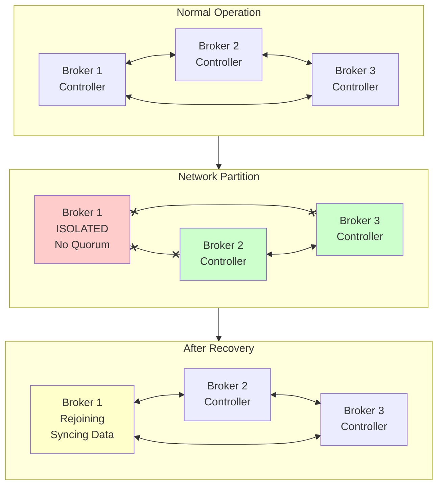

# Exercise 9.02: Chaos Engineering - Split-Brain Scenarios & Recovery

## Learning Objectives

- Understand what split-brain means in distributed systems
- Learn how Kafka's KRaft consensus prevents split-brain
- Simulate network partitions that could cause split-brain
- Observe quorum-based leader election during partitions
- Practice detecting and recovering from split-brain scenarios
- Understand the role of `unclean.leader.election.enable`
- Learn about data consistency vs. availability trade-offs

## What You'll Build

In this exercise, you'll:
1. **Multi-Broker Cluster**: 3-broker Kafka cluster with KRaft consensus
2. **Network Partitions**: Simulate network splits between brokers
3. **Split-Brain Detection**: Monitor for symptoms of split-brain
4. **Recovery Procedures**: Learn to recover from network partitions
5. **Data Consistency Checks**: Verify data integrity after recovery

## Prerequisites

- Completed exercises 1.01-9.01 (especially 9.01 Broker Failure)
- Docker and Docker Compose installed
- Understanding of Kafka replication and KRaft mode
- Basic knowledge of distributed consensus algorithms
- Go 1.21 or later (for test applications)

## Background

### What is Split-Brain?

**Split-brain** occurs in distributed systems when network partitions cause different parts of the cluster to operate independently, potentially believing they are each the "authoritative" source. This can lead to:

- Multiple leaders accepting writes for the same partition
- Data divergence between cluster segments
- Data loss or corruption when the partition heals
- Inconsistent reads depending on which segment a client connects to

```
┌─────────────────────────────────────────────────────────────────┐
│                    SPLIT-BRAIN SCENARIO                        │
├─────────────────────────────────────────────────────────────────┤
│                                                                 │
│  Network Partition                                              │
│         │                                                       │
│         ▼                                                       │
│  ┌──────────────┐    X    ┌──────────────────────────────────┐ │
│  │  Segment A   │ ─ ─ ─ ─ │         Segment B                │ │
│  │              │         │                                  │ │
│  │  [Broker 1]  │         │  [Broker 2]    [Broker 3]        │ │
│  │   Leader?    │         │   Leader?       Follower         │ │
│  │              │         │                                  │ │
│  │  Client A    │         │  Client B                        │ │
│  │  writes...   │         │  writes...                       │ │
│  └──────────────┘         └──────────────────────────────────┘ │
│                                                                 │
│  DANGER: Both segments may accept writes independently!        │
└─────────────────────────────────────────────────────────────────┘
```

### How Kafka Prevents Split-Brain

Kafka uses several mechanisms to prevent split-brain:

#### 1. KRaft Consensus (Raft Protocol)
- **Quorum-based voting**: Requires majority of controllers to agree
- **Leader election**: Only one active controller leader at a time
- **Epoch numbers**: Prevent stale leaders from accepting writes
- **3 controllers**: Requires 2/3 (majority) to form quorum

#### 2. In-Sync Replicas (ISR)
- **ISR tracking**: Only replicas in ISR can become leader
- **min.insync.replicas**: Require multiple replicas to acknowledge writes
- **Shrinking ISR**: Partitioned brokers are removed from ISR

#### 3. Unclean Leader Election
- **`unclean.leader.election.enable=false`**: Prevents out-of-sync replica from becoming leader
- **Data durability**: Prefer unavailability over data loss
- **Trade-off**: May cause temporary unavailability during partitions

### The Quorum Rule

With 3 controllers in KRaft mode:
- **Majority needed**: 2 out of 3 controllers must agree
- **Network partition scenarios**:
  - 1 broker isolated: 2 brokers maintain quorum ✓
  - 2 brokers isolated from each other: No quorum possible ✗
  - Symmetric split (1 vs 1 vs 1): No quorum possible ✗

| Scenario | Segment A | Segment B | Quorum? | Outcome |
|----------|-----------|-----------|---------|---------|
| 1 isolated | 1 broker | 2 brokers | Yes (B) | B continues, A stops |
| 2-way split | 1 broker | 2 brokers | Yes (B) | B continues, A stops |
| 3-way split | 1 each | 1 each | No | All segments stop |

## Architecture



## Tasks

### Task 1: Start the Cluster

Start the 3-broker Kafka cluster:

```bash
docker compose up -d
```

Wait 30-45 seconds for the cluster to fully initialize.

Verify all containers are running:

```bash
docker compose ps
```

### Task 2: Verify Cluster Health

Check the KRaft quorum status:

```bash
docker exec -it kafka-1 /opt/kafka/bin/kafka-metadata-quorum.sh \
  --bootstrap-server kafka-1:19092 describe --status
```

You should see all 3 voters with one being the leader.

Check all brokers are registered:

```bash
docker exec -it kafka-1 /opt/kafka/bin/kafka-broker-api-versions.sh \
  --bootstrap-server kafka-1:19092 | grep "id"
```

### Task 3: Identify the Active Controller Leader

Find which broker is the active KRaft controller leader:

```bash
docker exec -it kafka-1 /opt/kafka/bin/kafka-metadata-quorum.sh \
  --bootstrap-server kafka-1:19092 describe --status | grep -i leader
```

**Note the LeaderId** - this is the active controller. You'll need this later.

Also check in Kafka UI at http://localhost:8080 → Brokers.

### Task 4: Create Test Topic

Create a replicated topic:

```bash
docker exec -it kafka-1 /opt/kafka/bin/kafka-topics.sh \
  --create \
  --topic split-brain-test \
  --bootstrap-server kafka-1:19092 \
  --partitions 6 \
  --replication-factor 3 \
  --config min.insync.replicas=2
```

Describe the topic to see partition assignments:

```bash
docker exec -it kafka-1 /opt/kafka/bin/kafka-topics.sh \
  --describe \
  --topic split-brain-test \
  --bootstrap-server kafka-1:19092
```

Note which broker is leader for each partition.

### Task 5: Produce Baseline Data

Produce some initial messages:

```bash
for i in {1..50}; do
  echo "baseline-$i:Initial message $i"
done | docker exec -i kafka-1 /opt/kafka/bin/kafka-console-producer.sh \
  --topic split-brain-test \
  --bootstrap-server kafka-1:19092 \
  --property "parse.key=true" \
  --property "key.separator=:"
```

### Task 6: Start Continuous Producer

Open a new terminal and start the continuous producer:

```bash
cd producer
go run main.go
```

Keep this running - it will help visualize the impact of network partitions.

### Task 7: Start Consumer

Open another terminal and start the consumer:

```bash
cd consumer
go run main.go
```

### Task 8: Check Initial State

Before causing chaos, verify the healthy state:

```bash
# Under-replicated partitions (should be empty)
docker exec -it kafka-1 /opt/kafka/bin/kafka-topics.sh \
  --describe \
  --under-replicated-partitions \
  --bootstrap-server kafka-1:19092

# Quorum status
docker exec -it kafka-1 /opt/kafka/bin/kafka-metadata-quorum.sh \
  --bootstrap-server kafka-1:19092 describe --replication
```

### Task 9: Scenario 1 - Isolate Minority Broker (No Split-Brain)

This scenario shows a "safe" partition where the majority maintains quorum.

First, identify a non-controller broker to isolate. If broker-1 is the controller, isolate broker-3:

```bash
# First, find the actual network name (includes directory prefix)
docker network ls | grep kafka-cluster

# Disconnect broker-3 from the kafka-cluster network
# Replace NETWORK_NAME with the actual name from the command above
# It will be something like: 902-chaos-split-brain_kafka-cluster
docker network disconnect $(docker network ls --filter name=kafka-cluster -q) kafka-3
```

**Note**: The network name includes the directory prefix. The command above automatically finds the correct network name.

### Task 10: Observe Minority Isolation

Watch the producer and consumer terminals:

**Producer:**
- May see temporary errors for partitions led by broker-3
- Should recover as leadership moves to remaining brokers

**Consumer:**
- Brief pause during rebalance
- Continues consuming from available partitions

Check the quorum status:

```bash
docker exec -it kafka-1 /opt/kafka/bin/kafka-metadata-quorum.sh \
  --bootstrap-server kafka-1:19092 describe --status
```

You should see broker-3 is now a lagging observer, while brokers 1 and 2 maintain quorum.

### Task 11: Check Partition Leaders

```bash
docker exec -it kafka-1 /opt/kafka/bin/kafka-topics.sh \
  --describe \
  --topic split-brain-test \
  --bootstrap-server kafka-1:19092
```

Observe:
- Partitions previously led by broker-3 have new leaders
- ISR shows only brokers 1 and 2
- Cluster continues operating with 2/3 brokers

### Task 12: Verify Writes Still Work

```bash
echo "test-during-partition:Message during network partition" | \
docker exec -i kafka-1 /opt/kafka/bin/kafka-console-producer.sh \
  --topic split-brain-test \
  --bootstrap-server kafka-1:19092 \
  --producer-property acks=all \
  --property "parse.key=true" \
  --property "key.separator=:"
```

The write succeeds because:
- 2 brokers are in ISR
- `min.insync.replicas=2` is satisfied
- Quorum (2/3 controllers) is maintained

### Task 13: Reconnect Isolated Broker

Heal the network partition:

```bash
docker network connect $(docker network ls --filter name=kafka-cluster -q) kafka-3
```

Wait 15-20 seconds for broker-3 to rejoin.

### Task 14: Verify Recovery

Check quorum status:

```bash
docker exec -it kafka-1 /opt/kafka/bin/kafka-metadata-quorum.sh \
  --bootstrap-server kafka-1:19092 describe --status
```

Broker-3 should rejoin as a follower/voter.

Check ISR recovery:

```bash
docker exec -it kafka-1 /opt/kafka/bin/kafka-topics.sh \
  --describe \
  --topic split-brain-test \
  --bootstrap-server kafka-1:19092
```

All partitions should show all 3 brokers in ISR again.

### Task 15: Scenario 2 - Isolate Controller Leader

Now let's isolate the active controller leader - this is more disruptive.

Find the current controller leader:

```bash
docker exec -it kafka-1 /opt/kafka/bin/kafka-metadata-quorum.sh \
  --bootstrap-server kafka-1:19092 describe --status | grep LeaderId
```

Assume broker-1 is the controller leader. Isolate it:

```bash
docker network disconnect $(docker network ls --filter name=kafka-cluster -q) kafka-1
```

### Task 16: Observe Controller Election

This triggers a controller election!

Check from broker-2:

```bash
docker exec -it kafka-2 /opt/kafka/bin/kafka-metadata-quorum.sh \
  --bootstrap-server kafka-2:19094 describe --status
```

You should see:
- New LeaderId (broker-2 or broker-3)
- Broker-1 shown as lagging/offline

Watch the producer/consumer:
- Brief disruption (few seconds)
- Reconnects to remaining brokers
- Operations continue

### Task 17: What Happens to the Isolated Controller?

Check broker-1's perspective (connect via external port):

```bash
# This may timeout or show errors - broker-1 has lost quorum
docker exec -it kafka-1 /opt/kafka/bin/kafka-metadata-quorum.sh \
  --bootstrap-server localhost:9092 describe --status 2>&1 || echo "Broker isolated - cannot reach quorum"
```

The isolated broker-1:
- Cannot form quorum alone (1/3 is not majority)
- Stops accepting writes
- Enters a "fenced" state
- **This is split-brain prevention in action!**

### Task 18: Verify No Split-Brain Writes

Try to write to the isolated broker:

```bash
echo "isolated-write:This should fail" | \
timeout 10 docker exec -i kafka-1 /opt/kafka/bin/kafka-console-producer.sh \
  --topic split-brain-test \
  --bootstrap-server localhost:9092 \
  --producer-property acks=all \
  --property "parse.key=true" \
  --property "key.separator=:" 2>&1 || echo "Write failed (expected!)"
```

The write should fail or timeout - the isolated broker correctly refuses writes because it lacks quorum.

### Task 19: Reconnect Controller

```bash
docker network connect $(docker network ls --filter name=kafka-cluster -q) kafka-1
```

Wait 20-30 seconds for broker-1 to rejoin and sync.

### Task 20: Verify Full Recovery

```bash
docker exec -it kafka-1 /opt/kafka/bin/kafka-metadata-quorum.sh \
  --bootstrap-server kafka-1:19092 describe --status

docker exec -it kafka-1 /opt/kafka/bin/kafka-topics.sh \
  --describe \
  --topic split-brain-test \
  --bootstrap-server kafka-1:19092
```

All brokers should be back in sync.

### Task 21: Scenario 3 - Symmetric Network Partition (Total Split)

This scenario creates a true split-brain situation where no segment has quorum.

Isolate broker-1 AND broker-2 from broker-3, AND broker-1 from broker-2:

```bash
# First, pause all brokers to prevent data divergence during setup
docker pause kafka-1 kafka-2 kafka-3

# Disconnect all brokers from kafka-cluster network
KAFKA_NET=$(docker network ls --filter name=kafka-cluster -q)
docker network disconnect $KAFKA_NET kafka-1 || true
docker network disconnect $KAFKA_NET kafka-2 || true  
docker network disconnect $KAFKA_NET kafka-3 || true

# Unpause - each broker is now isolated
docker unpause kafka-1 kafka-2 kafka-3
```

### Task 22: Observe Complete Cluster Unavailability

Try to produce:

```bash
echo "no-quorum:This should fail" | \
timeout 10 docker exec -i kafka-1 /opt/kafka/bin/kafka-console-producer.sh \
  --topic split-brain-test \
  --bootstrap-server localhost:9092 \
  --producer-property acks=all \
  --property "parse.key=true" \
  --property "key.separator=:" 2>&1 || echo "Write failed - no quorum"
```

**Expected behavior**: All writes fail because no segment has quorum (majority).

The producer and consumer applications will show errors and retry.

### Task 23: Understand Why This is Safe

Even though the cluster is unavailable, this is the **correct behavior**:

1. **No segment can elect a leader**: Each broker is alone (1/3), can't form majority
2. **No split-brain writes**: No data divergence can occur
3. **Data integrity preserved**: All previously written data is safe
4. **Availability sacrificed for consistency**: This is the "CP" in CAP theorem

### Task 24: Recover from Total Partition

Reconnect all brokers:

```bash
KAFKA_NET=$(docker network ls --filter name=kafka-cluster -q)
docker network connect $KAFKA_NET kafka-1
docker network connect $KAFKA_NET kafka-2
docker network connect $KAFKA_NET kafka-3
```

Wait 30-45 seconds for the cluster to reform.

### Task 25: Verify Cluster Recovery

```bash
# Check quorum
docker exec -it kafka-1 /opt/kafka/bin/kafka-metadata-quorum.sh \
  --bootstrap-server kafka-1:19092 describe --status

# Check topics
docker exec -it kafka-1 /opt/kafka/bin/kafka-topics.sh \
  --describe \
  --topic split-brain-test \
  --bootstrap-server kafka-1:19092

# Verify no under-replicated partitions
docker exec -it kafka-1 /opt/kafka/bin/kafka-topics.sh \
  --describe \
  --under-replicated-partitions \
  --bootstrap-server kafka-1:19092
```

### Task 26: Scenario 4 - Simulating Unclean Leader Election Risk

Let's understand what happens with `unclean.leader.election.enable=true` (NOT recommended for production).

First, create a test topic with unclean election enabled:

```bash
docker exec -it kafka-1 /opt/kafka/bin/kafka-topics.sh \
  --create \
  --topic unclean-test \
  --bootstrap-server kafka-1:19092 \
  --partitions 1 \
  --replication-factor 3 \
  --config min.insync.replicas=1 \
  --config unclean.leader.election.enable=true
```

**Warning**: This configuration prioritizes availability over consistency.

### Task 27: Demonstrate Unclean Election Risk

Produce some messages:

```bash
for i in {1..20}; do
  echo "msg-$i:Message $i"
done | docker exec -i kafka-1 /opt/kafka/bin/kafka-console-producer.sh \
  --topic unclean-test \
  --bootstrap-server kafka-1:19092 \
  --producer-property acks=all \
  --property "parse.key=true" \
  --property "key.separator=:"
```

Find the leader for partition 0:

```bash
docker exec -it kafka-1 /opt/kafka/bin/kafka-topics.sh \
  --describe \
  --topic unclean-test \
  --bootstrap-server kafka-1:19092
```

### Task 28: Create Dangerous Scenario

1. Stop the two followers (keep only leader running):

```bash
# Assume broker-1 is leader for partition 0
# Stop broker-2 and broker-3
docker stop kafka-2 kafka-3
```

2. Produce more messages (only to leader):

```bash
for i in {21..40}; do
  echo "msg-$i:Message $i (only on leader)"
done | docker exec -i kafka-1 /opt/kafka/bin/kafka-console-producer.sh \
  --topic unclean-test \
  --bootstrap-server kafka-1:19092 \
  --producer-property acks=1 \
  --property "parse.key=true" \
  --property "key.separator=:"
```

3. Now stop the leader (simulating failure before replication):

```bash
docker stop kafka-1
```

4. Start the followers:

```bash
docker start kafka-2 kafka-3
```

### Task 29: Observe Unclean Leader Election

Wait 30 seconds, then check the topic:

```bash
docker exec -it kafka-2 /opt/kafka/bin/kafka-topics.sh \
  --describe \
  --topic unclean-test \
  --bootstrap-server kafka-2:19094
```

With `unclean.leader.election.enable=true`:
- A follower (broker-2 or broker-3) becomes leader
- **Messages 21-40 are LOST** - they were only on broker-1

Count messages:

```bash
docker exec -it kafka-2 /opt/kafka/bin/kafka-run-class.sh \
  kafka.tools.GetOffsetShell \
  --broker-list kafka-2:19094 \
  --topic unclean-test
```

You'll likely see only ~20 messages, not 40.

### Task 30: Recover and Verify Data Loss

Start broker-1:

```bash
docker start kafka-1
```

Wait for it to sync:

```bash
docker exec -it kafka-1 /opt/kafka/bin/kafka-topics.sh \
  --describe \
  --topic unclean-test \
  --bootstrap-server kafka-1:19092
```

The messages 21-40 are permanently lost - broker-1 was truncated to match the new leader.

**This is why `unclean.leader.election.enable=false` is critical for data integrity!**

### Task 31: Compare with Safe Topic

Check the `split-brain-test` topic which has `unclean.leader.election.enable=false`:

```bash
docker exec -it kafka-1 /opt/kafka/bin/kafka-run-class.sh \
  kafka.tools.GetOffsetShell \
  --broker-list kafka-1:19092 \
  --topic split-brain-test
```

No messages should be lost from this topic, even after all the chaos.

### Task 32: Monitor Split-Brain Indicators

Key metrics to monitor for split-brain symptoms:

```bash
# Check for offline partitions (potential split-brain indicator)
docker exec -it kafka-1 /opt/kafka/bin/kafka-topics.sh \
  --describe \
  --unavailable-partitions \
  --bootstrap-server kafka-1:19092

# Check controller quorum state
docker exec -it kafka-1 /opt/kafka/bin/kafka-metadata-quorum.sh \
  --bootstrap-server kafka-1:19092 describe --replication
```

In Grafana (http://localhost:3000), look for:
- **UnderReplicatedPartitions**: Sustained high value
- **OfflinePartitionsCount**: Any value > 0
- **ActiveControllerCount**: Should always be 1
- **LeaderElectionRate**: Frequent elections may indicate issues

### Task 33: Clean Up Test Topics

```bash
docker exec -it kafka-1 /opt/kafka/bin/kafka-topics.sh \
  --delete \
  --topic unclean-test \
  --bootstrap-server kafka-1:19092
```

### Task 34: Verify Final Cluster Health

```bash
# Quorum healthy
docker exec -it kafka-1 /opt/kafka/bin/kafka-metadata-quorum.sh \
  --bootstrap-server kafka-1:19092 describe --status

# No under-replicated partitions
docker exec -it kafka-1 /opt/kafka/bin/kafka-topics.sh \
  --describe \
  --under-replicated-partitions \
  --bootstrap-server kafka-1:19092

# No unavailable partitions
docker exec -it kafka-1 /opt/kafka/bin/kafka-topics.sh \
  --describe \
  --unavailable-partitions \
  --bootstrap-server kafka-1:19092
```

### Task 35: Clean Up

Stop the producer and consumer (Ctrl+C).

Stop the cluster:

```bash
docker compose down
```

## Key Concepts

### Split-Brain Prevention Mechanisms

| Mechanism | How It Prevents Split-Brain |
|-----------|----------------------------|
| KRaft Quorum | Requires majority (2/3) for leader election |
| Controller Fencing | Isolated controller stops accepting requests |
| ISR Tracking | Only in-sync replicas can become leader |
| Epoch Numbers | Stale leaders rejected by followers |
| unclean.leader.election | Prevents out-of-sync replica from leading |

### Network Partition Outcomes

| Partition Type | Quorum | Outcome |
|----------------|--------|---------|
| 1 vs 2 brokers | Yes (2) | Minority stops, majority continues |
| 2 vs 1 brokers | Yes (2) | Minority stops, majority continues |
| 1 vs 1 vs 1 | No | All segments stop (safe!) |

### Configuration Best Practices

```properties
# CRITICAL: Prevent data loss from split-brain
unclean.leader.election.enable=false

# Require multiple replicas for writes
min.insync.replicas=2

# Replication factor of 3 allows 1 failure
replication.factor=3

# All ISR replicas must acknowledge
acks=all

# Producer should retry on transient failures
retries=2147483647
enable.idempotence=true
```

### Recovery Checklist

When recovering from a network partition:

1. [ ] Identify which segment had quorum (if any)
2. [ ] Reconnect isolated brokers to the network
3. [ ] Wait for brokers to rejoin the quorum
4. [ ] Verify ISR includes all brokers
5. [ ] Check for under-replicated partitions
6. [ ] Verify no offline partitions
7. [ ] Run preferred leader election if needed
8. [ ] Verify producer/consumer connectivity
9. [ ] Check message counts for data loss

### Symptoms of Split-Brain (If It Occurs)

If split-brain does occur (e.g., due to misconfiguration), symptoms include:

- Different message counts on different brokers
- Duplicate messages with same offset but different content
- Consumer seeing inconsistent data
- Log warnings about epoch mismatches
- Brokers refusing to sync due to divergent logs

## Troubleshooting

**Broker won't rejoin after partition heals:**
- Check logs for fencing errors
- Verify network connectivity
- May need to restart the broker
- Check if data directory is corrupted

**Writes failing despite brokers being up:**
- Check ISR - may not have enough replicas
- Verify quorum status
- Check min.insync.replicas setting
- Ensure network connectivity between brokers

**Consumers not receiving messages after recovery:**
- Check consumer group status
- May need to reset offsets
- Verify topic is available
- Check for rebalancing issues

**Data loss detected:**
- Review unclean.leader.election setting
- Check if acks=all was used
- Review min.insync.replicas
- Examine broker logs for truncation events

## Resources

- [KRaft: Apache Kafka Without ZooKeeper](https://developer.confluent.io/learn/kraft/)
- [Kafka Replication Design](https://kafka.apache.org/documentation/#replication)
- [Understanding Kafka's ISR](https://www.confluent.io/blog/hands-free-kafka-replication-a-lesson-in-operational-simplicity/)
- [CAP Theorem and Kafka](https://www.confluent.io/blog/exactly-once-semantics-are-possible-heres-how-apache-kafka-does-it/)
- [Raft Consensus Algorithm](https://raft.github.io/)
